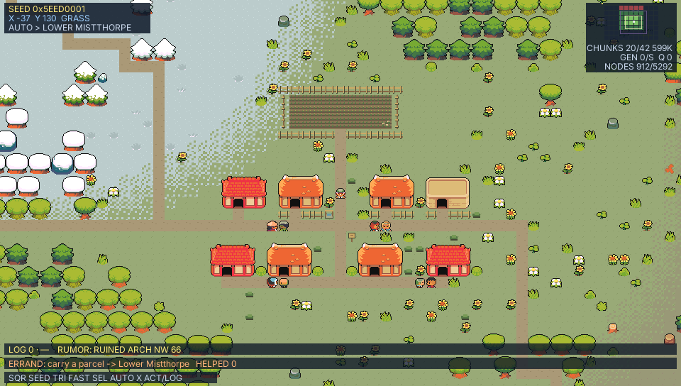

# pocket-rpgkit

A reusable 2D tile-RPG runtime and the **`rpgkit-project/v1`** data format,
built on [PocketJS](https://github.com/pocket-nexus/pocketjs). It contains
the parts an RPG-Maker-style game needs without any specific game:

- **pure-TS engine** (`src/engine/`) — tile movement and collision, the
  event interpreter (pages, triggers, 72 commands), map-character motion,
  multi-map sessions, deterministic extension state and battle scenes,
  deterministic save snapshots. No host imports, no
  wall clock, no `Math.random`: a session is one pure fold per virtual
  frame, so a button tape replays byte-for-byte on every host;
- **Solid UI components** (`src/ui/`) — `GameView`, a complete game screen
  for a project (chunked maps, scripted/follow camera, NPCs, dialog, screen
  fades/tints/flashes/shakes, opt-in numbered pictures and timer/map-name HUD,
  character balloons, cutscene backdrops, and optional attract mode), plus
  the blocks it is made of: `DialogBox`,
  `PlayerSprite`, `ChunkLayer`, `StreamedChunkLayer`, `AnimatedTiles`,
  `SaveMenu`, `Panel`.
  The framed ones take a
  colour theme, and `DialogBox` shows speaker portraits;
- **attract mode** (`src/engine/attract.ts`) — after 10 idle seconds a
  recorded playthrough replays from a clean world; any button takes over
  on that very frame, **L** rewinds 3 virtual seconds, and **SELECT** hands
  the session back to the demo (or opens the optional demo menu). Demo and player input are one u16 stream,
  so rewind undoes the player's moves exactly like the tape's. Runtime-only,
  bounded keyframes make a long-tape rewind fold only a short suffix;
- **host adapters** (`src/host/`) — the `data.fs` save slot store, dedicated
  browser/sim/desktop autosave bridges, and the attract-tape override loader;
- **build-time asset pipelines** (`tools/lib/`) — tile sheets to baked
  512px PSM_4444 canvases and chunks, or 256px CLUT8+RLE streamed chunks,
  one-image CLUT8+PackBits entries loaded only when shown, native animated-tile
  atlases, 16×16 or 16×32 static walker frames, and the `GameAssets` manifest
  a game mounts;
- **the format** (`src/data/schema.json`, v1; changes recorded in
  `src/data/CHANGELOG.md`);
- **five examples** (`examples/`), each a PocketJS app with its own art
  and tests on the wasm sim host (below);
- **a map/event editor, in preview** (`editor/`): paints tiles, edits event
  footprints/pages/conditions/command trees, and runs the unsaved document
  through the production game view with a live state debugger
  ([below](#editor-preview)).

What is done, partial or still planned is tracked area by area in
[docs/status.md](docs/status.md).

## Examples

### `examples/showcase` — Pocket RPG Kit Feature Gallery


One walkable miniature monster-RPG town collects the kit's presentation,
animation, movement, extension, battle, shop, streaming, theme, save,
deterministic-replay, audio and scene features in fourteen repeatable halls.
The Registration Desk uses the built-in name-input scene and addresses the
player by that name in later dialogue. Its
[room-by-room catalogue](examples/showcase/README.md) links each demonstration
to its authoring source and the separately licensed Tuxemon assets.

| | |
| --- | --- |
|  |  |
| **`examples/sunstone`** — *The Sunstone of Bramble Hollow*, a three-map RPG (village → forest → cave: key chest, rune stone, thorn and iron gates, the relic). Idle for 10 s and it plays itself from a frozen 539-frame winning tape; press any button to take over mid-demo, **L** to rewind, or **SELECT** for chapters, map warp and autoplay speed. | **`examples/grow`** — four villages grow through grass, mud, sand and snow from causes, not templates: they settle by water, farm, log and quarry, wear roads where their people walk, trade surpluses along caravan roads, and starve, empty and fall to ruin when the winter is too hard. Every event is recorded: scrub the timeline (**L/R**, touch, or mouse drag) to any tick, **UP/DOWN** to step between events, tap a place to read its history, **SQUARE** for a new seed, **CIRCLE** to walk into the finished world, played as a generated `rpgkit-project/v1` document. See [its README](examples/grow/README.md). |

On the macOS desktop host (`bun run desktop sunstone`, `bun run desktop
grow`; Metal, captured on an Apple M5 Pro):

| | |
| --- | --- |
|  |  |

### `examples/wander` — an endless world that grows as you walk

| | |
| --- | --- |
|  |  |
| A grown town beside a snow border (sim golden) | On the macOS desktop host (`bun run desktop wander`), walking to a clicked tile |

An unbounded 2D world streams in and out of memory around the walker.
Nothing about it is stored: every 32×32-tile chunk is a pure function of
the seed and its coordinates (tested byte-identical in any generation
order, after eviction, and at (±100000, ±100000)), so the only state is a
cache. Biomes are low-frequency 2D noise cut into snow, grass, mud and
sand, with grow's transition / blend / fringe seam art on every border;
woods and meadows are grow's coordinate-hashed Ninja stamps.

- **Regions and gates.** Every 96×96-tile region holds at most one town,
  placed by hashed jitter with a chance by biome, and grown with grow's
  rules in 2D (plaza, main and cross street, road-facing lots and a back
  lane, the biome's work plot, one resident per house walking a road
  route). Each shared region edge has a hashed gate that both sides
  compute identically; each region runs its own trunk road from its town
  (or a signposted crossroads) to its gates, so roads meet across region
  borders without any global state.
- **Growth.** When a town first enters the growth ring ahead of the
  walker it grows over a few seconds — roads, then houses, fields,
  residents — and its state at *t* seconds after discovery is "every cell
  born by then". A bounded Bloom filter remembers what was seen; a region
  met again shows complete.
- **Rings.** The render ring (viewport plus overscan) is the only thing
  mounted, as pooled native nodes with a hard cap (whole-stamp trees and
  houses, 256 and 64 px fills, 16 px seams and roads). The load ring
  generates chunks, the unload ring (load + hysteresis) evicts them, and a
  hard LRU cap and byte estimate bound the cache. Generation is a work
  queue ordered by distance to the focus (the walker plus a lead) and
  alignment with the heading, spent in slices under a per-tick budget; an
  unready chunk shows its biome's fill and fills in when it arrives.
- **Walking.** The kit's unchanged engine plays a sliding 3×3-chunk window
  emitted as a normal `rpgkit-project/v1` document. Entering a new chunk
  re-centres it (a floating origin): the next window is built in budgeted
  slices and the session state is translated, so positions stay small and
  exact and nothing on screen moves. Houses, fences, props and tree trunks
  block; canopies are walked under; residents walk their routes.
- **Attract.** An auto-wander driver (A* over the window, preferring
  roads) walks from town to town by itself. Any d-pad or face button takes
  over; ten idle seconds hand the walk back. **SQUARE** grows a new seed,
  **TRIANGLE** toggles fast travel, **SELECT** hands back at once, and a
  tap walks to the tapped tile. The HUD shows the seed, world
  coordinates, the chunk minimap (rendered / resident / queued / evicted,
  with the load and unload rings) and the residency counters.

Generation, discovery and the window swap all happen per 60 Hz reference
tick, so the world, its residency and the auto-wander trajectory are
identical at 60/30/20/4 Hz. The example bakes no new terrain: it points at
grow's PNGs in place (`../grow/assets/...`) and adds only whole-stamp and
64 px fill composites of them (`bun examples/wander/gen-assets.ts`).

**`examples/meadow`** is the minimal example: one 20×12 map and four
events proving the package boots, renders, replays deterministically,
and round-trips on the PocketJS wasm sim host.

Everything runs on a fixed 60 Hz virtual-time reference: a host at 30,
20 or 4 Hz folds 2, 3 or 15 reference ticks per frame, so the world at a
given virtual moment is the same at every rate (the journey tests drive
each example's winning run at 60/30/20/4 Hz and compare milestones).

The runtime pins PocketJS with a git submodule at
`vendor/pocketjs` (commit recorded in `git submodule status`).

## Play in the browser

The examples and the editor run in the browser at
**<https://lfkdsk.github.io/pocketjs-rpgkit/>**. Each page runs its bundle on
the PocketJS core compiled to WebAssembly: the same bundle and core the sim
tests use. On a game page, click the game (it also takes the keyboard when the
page loads), then use the arrow keys and **A**/**Enter**/**Z** to confirm.
Each page lists the rest of its controls. Grow's timeline also takes a mouse
or touch drag, and phones get on-screen buttons.

The [browser editor](https://lfkdsk.github.io/pocketjs-rpgkit/editor/) can
open a local `rpgkit-project/v1` JSON file or start from the bundled Sunstone
and Meadow projects. **Save** keeps the current document in this browser's
local storage, **Download** writes a JSON file, and a refresh restores the
locally saved document. Project data is not uploaded. Storage errors are
shown on the page; use Download for a durable copy. The browser editor uses
the bundled example art and inline project documents: it does not import
assets or edit large sharded projects.

To build the site locally (no dev server; any static file server works):

```sh
bun run build:wasm                      # once: the wasm core
bun run web                             # dist/web: landing page, examples and editor
python3 -m http.server -d dist/web 8000 # then open http://localhost:8000/
bun tools/web-verify.ts                 # optional: play every page in headless Chrome
```

`bun run web` builds every app in `APPS` (`tools/build-example.ts`), including
the editor, and `bun run web grow` builds one named app. Each app is resolved
against the `web-app` target from its `pocket.json`. Card text, preview images
and controls come from `web.json`. An example without an entry still gets a
card: its `pocket.json` title, default controls, and a preview rendered from
its own bundle. Every URL is relative, so the site works under any path.
`.github/workflows/pages.yml` publishes `dist/web` to GitHub Pages on every
push to `main`. Player pages mount the PocketJS audio
host before the game starts, load their AudioWorklet relative to the page,
and expose mute and master-volume controls. Browsers start the audio clock on
the first key or pointer gesture, as required by their autoplay policies.

Web builds use a 2× raster density by default so fonts and vector assets are
baked and drawn at two physical samples per logical pixel. Set
`rasterDensity` on a game's `web.json` entry to choose an integer from 1
through 4:

```json
{
  "games": {
    "meadow": {
      "rasterDensity": 2
    }
  }
}
```

Density changes the browser build only. Desktop, PSP and other targets keep
the density from their own target contract. A 1× PNG without an `@2x` variant
is still sampled with nearest-neighbour filtering, so pixel-art tiles and
walkers stay hard-edged; fonts and available density-specific assets gain the
extra detail. The backing framebuffer uses `density²` as many pixels, and
font/vector entries make the pak larger, so 2× is the recommended balance.
Use 1× for lower-powered browsers, and reserve 3× or 4× for projects that have
measured the extra memory and raster cost.

The player also snaps its presentation scale to a multiple of the raster
density. Consequently each backing-store sample occupies a whole number of
device pixels whenever the viewport can fit at native density, including on
fractional-DPR displays. A window too small to fit one native-density frame
falls back to a fitted presentation instead of overflowing.

A game that vendors this kit builds its own site the same way, for example
Alpine Post:

```sh
bun vendor/pocket-rpgkit/tools/web.ts --project-root . alpine-post
```

The site also serves **`preview-demo.html`**, the reference frontend for the
`rpgkit-preview/v1` postMessage protocol: paste any `rpgkit-project/v1`
document and play it in the embedded host — load, start at a tile, read
state, inject input, stop. See [Protocols](#protocols).

## Quick start

```sh
git clone --recurse-submodules https://github.com/lfkdsk/pocketjs-rpgkit.git
cd pocket-rpgkit
bun install
bun test                 # reducer/format/controller suites; sim cases skip
bun run build:wasm       # one-time: compile the vendored sim core
bun run build:example    # build showcase and the other examples, editor and test fixtures into dist/
bun test                 # full suite incl. sim journeys and pixel goldens
bunx tsc --noEmit        # typecheck, exit 0
bun run desktop sunstone # build for the desktop host and open a window
                         # (also: grow, wander, meadow; needs a Rust toolchain)
bun run web              # the browser site in dist/web (see above)
```

On a Mac, `bun run package:macos sunstone` (or `grow`, `wander`, `meadow`) makes a
double-clickable `dist/macos/<Name>.app` plus a zip to hand around: the
desktop host, the example's bundle and pak, an icon cropped from its
golden frame, and the licenses. It is built for the Mac's own
architecture and ad-hoc signed, not notarized, so a downloaded copy opens
the first time with right-click > Open (or Privacy & Security > Open
Anyway). A game that vendors this kit packages itself with
`bun vendor/pocket-rpgkit/tools/package-macos.ts --project-root .`
(`--name`, `--icon <png>`, `--icon-crop x,y,w,h` to taste).

`bun run build:example sunstone` builds one example. `bun run gen-assets`
regenerates every example's baked art from its `assets/src/` (and then the
editor's tile cells from those sheets); the cookers are deterministic and
reproduce the committed PNGs byte for byte.

## Editor (preview)

`editor/` is a map/event editor for `rpgkit-project/v1` documents and a
PocketJS app on both the desktop host and the
[browser site](https://lfkdsk.github.io/pocketjs-rpgkit/editor/). It opens the
Sunstone and Meadow documents (`examples/*/data/*.json`) and paints them with
those examples' own Kenney tile sheets. The browser can also **Open** a local
inline project; **Save** keeps it in that browser, **Download** exports JSON,
and a refresh restores the locally saved copy. Nothing is uploaded.

For editing in a browser there is also **Studio**
([`docs/studio.md`](docs/studio.md),
[hosted](https://lfkdsk.github.io/pocketjs-rpgkit/studio/), and as a
[desktop app](docs/studio-desktop.md) that saves project folders in place,
runs local agents and runs `rpgkit-check`'s engine checks): a DOM + canvas
editor with a zoomable canvas, tile palette, inspector forms and a history
panel. Both Studio and this PocketJS editor make every change through the
`editor/api` operations that `rpgkit-edit` runs and keep reversible
`rpgkit-edit/patch-v1` undo/redo history; a test in
`tests/editor-api-equivalence.test.ts` checks that the same edits produce
identical patches, history and saved bytes in both. This PocketJS editor is
the one that also runs on devices.

What it does today:

- paint ground tiles by click or drag; the first header button cycles
  ground, sparse upper (star), passage, and event modes; right click or
  shift+click erases tiles;
- paint per-cell `passage` overrides (pass/block) and toggle one-sided
  sheet `dirEdges` enter/exit edges, with corner markers and edge arrows;
- select and drag full multi-cell event footprints; create, copy, delete,
  resize and name events;
- add, delete, copy and reorder pages; edit triggers, sprites, facing,
  blocking, autonomous/basic route motion, and flat/compound conditions;
- inspect recursive command trees with visible `if`, choices, battle,
  scene and loop branches; structurally edit the built-in authoring commands while
  preserving `shop`, `ext`, `battle`, `scene`, and advanced route payloads
  read-only;
- pick a transfer command's destination on the canvas (PICK button, then
  click a cell on any map);
- map inspector: rename (following `start.map` and every transfer),
  resize, edit sheets, and create/duplicate/delete maps (delete lists
  every transfer reference with a pageable command location and asks for a
  second confirm); inspector-local notices keep crop lists and save errors
  visible;
- review AI edit proposals for inline desktop projects from **PROPOSALS**:
  inspect author/rationale and
  per-hunk conflict state, locate each hunk, preview proposed tiles as
  translucent art and event changes as color-coded boxes, then accept or
  reject one hunk or accept every clean hunk; one accept action is one undo
  step and rejection never edits the document;
- ask a configured local agent for a proposal from the natural-language box
  for an inline desktop project;
  the request carries the current map and explicit cell/event selection, and
  the agent's MCP server permits proposal creation but no direct project edit;
- undo/redo, one step per tile stroke or event/map transaction, 64 steps
  deep (header buttons or Cmd+Z / Cmd+Shift+Z);
- switch between a document's maps; the palette shows the sheets the
  current map declares;
- open a sharded `ProjectShell` with a virtualized map catalog, load maps on
  demand into a bounded clean-map cache, and save only dirty shards plus the
  refreshed shell after host acknowledgement;
- save through the schema validator (`src/data/schema.json`): an invalid
  export is refused with its first error, an unedited one saves back byte
  for byte, and an edit reuses untouched event/source spans without a
  whole-file reformat;
- PLAY the current in-memory document (unsaved edits included) through the
  production `GameView`, starting at the last selected cell or the authored
  project start; STOP/Escape/START returns without replacing editor state or
  undo history;
- open a live debugger for switches, variables, current-map self switches,
  items, gold, active pages and fiber command addresses; FRESH/LAST chooses
  whether the next run inherits the previous run's switches and variables;
- visibly degrade missing game registrations: unknown extensions are
  disabled, battles use a deterministic win/escape preview, unregistered
  scenes use a visible placeholder, and screen backdrops use placeholders
  instead of crashing the editor.

Not yet: common-event lists, asset import, or sheet-level `dirBlock` /
`defaultPassage` editing. The grow example's generated settlement is not
wired in: its sheet is synthesized by its cooker rather than cut from a
source PNG.

```sh
bun run editor                    # Sunstone, on a working copy in dist/editor/
bun run editor meadow             # Meadow
bun run editor sunstone --file my-map.json   # another file (seeded if missing)
bun run editor --agent traecli       # default built-in local-agent adapter
bun run editor --agent claude        # Claude Code adapter
bun run editor --agent-config editor/agent-config.example.json
bun run editor --file game/data/project.json # existing sharded ProjectShell
bun run editor --build-only       # bundle + release host, no window
```

The desktop launcher builds `dist/<target>/editor.{js,pak}` and the Rust host,
then opens the window with the `rpgkit-editor` companion and `--file`: the
host forwards the real mouse and keyboard and writes each save to that
file, by default a working copy in `dist/editor/` seeded from the
example (the example games build their documents from code, and
`bun run gen-assets` rewrites `data/*.json`).
The launcher also bridges `<project.json>.proposals/` into the editor's
sandboxed `data.fs` and writes review decisions back while the window is
open. Fully reviewed proposals move to the sidecar's `archive/` directory.
A sharded project (a `ProjectShell` with separate map files) instead uses a
confined file companion that sends only the shell at first, answers map reads
lazily, and commits changed shards before the refreshed shell; proposal
review and local-agent requests are unavailable in that session.
For an inline project, the same launcher owns the optional local-agent process
and sends only its proposal results back to the editor. Adapter and custom
command details are in the
[agent integration reference](docs/edit-api.md#editor-local-agent-integration).
The website supplies its own browser companion for pointer and keyboard
input, local storage, Open and Download. It also opens a self-contained
`rpgkit-edit/sharded-pack-v1` file and downloads a complete replacement pack;
it cannot overwrite a local directory. Without a companion (the bare wasm
sim, or a browser other than the website) the editor runs from buttons behind
a visible banner.
`bun run build:editor` builds the sim bundle alone; the editor's tests include
`tests/editor-model.test.ts`, `tests/editor-sim.test.ts`, the proposal review
golden in `tests/editor-proposal-sim.test.ts`, the offline local-agent flow in
`tests/editor-agent-sim.test.ts`, the two-size event
inspector/runtime round trip in `tests/editor-event-sim.test.ts`, and the
real-GameView play/debug goldens in `tests/editor-playtest-sim.test.ts`.
[`docs/editor-tutorial.md`](docs/editor-tutorial.md) follows one small
scenario — a villager NPC, a second map, and a play-test — from launch to
save, with regenerable screenshots and a guard test. More in
[`editor/README.md`](editor/README.md); the tile art's licenses are in the
examples' `ATTRIBUTION.md` files.

## Scripting and agents

`rpgkit-edit` exposes the editor's pure model as a stable JSON-in/JSON-out
interface. It is meant for scripts and coding agents that should edit project
documents without joining the running game or editor process. Every request
parses and validates the input document first. Every effective project mutation is
validated again, returns JSON Pointer changes with before/after values and an
`rpgkit-edit/patch-v1` reversible patch. Inline projects are atomically
replaced as one file. Sharded updates stage and conflict-check all outputs,
then publish changed shards before the shell manifest with best-effort
rollback; they are not crash-atomic across files.
`--dry-run` follows the same path but never writes. The full parameter,
output, error-code and MCP reference for every subcommand is
[`docs/edit-api.md`](docs/edit-api.md).

```sh
# Discover stable map/event/page/command addresses.
bun run rpgkit-edit list-maps --file game/data/project.json
bun run rpgkit-edit list-events --file game/data/project.json \
  --json '{"map":"village"}'
bun run rpgkit-edit list-commands --file game/data/project.json \
  --json '{"map":"village","event":"elder","page":0}'

# Preview one edit. stdout is exactly one JSON result.
bun run rpgkit-edit paint-rect --file game/data/project.json --dry-run \
  --json '{"map":"village","layer":"ground","x":4,"y":6,"width":3,"height":2,"tile":"town.43"}' \
  > preview.json

# Apply that exact patch later (use direction:"reverse" to undo it).
jq '{patch:.patch}' preview.json > apply.json
bun run rpgkit-edit save --file game/data/project.json --json @apply.json
```

For human-reviewed AI work on an inline project, group typed edit operations
into explicit hunks and create a proposal instead of mutating the project:

```json
{
  "id": "agent-welcome-path-1",
  "title": "Clarify the welcome path",
  "rationale": "Guide the player toward the elder without changing collision.",
  "author": "local-agent",
  "hunks": [
    {
      "id": "entrance-tiles",
      "summary": "Brighten two entrance tiles",
      "operations": [
        {
          "command": "paint-rect",
          "args": {
            "map": "village",
            "layer": "ground",
            "x": 4,
            "y": 6,
            "width": 2,
            "height": 1,
            "tile": "town.43"
          }
        }
      ]
    }
  ]
}
```

```sh
bun run rpgkit-edit propose --file game/data/inline-project.json \
  --json @welcome-proposal.json
bun run rpgkit-edit list-proposals --file game/data/inline-project.json
bun run rpgkit-edit show-proposal --file game/data/inline-project.json \
  --json '{"id":"agent-welcome-path-1"}'
bun run rpgkit-edit withdraw-proposal --file game/data/inline-project.json \
  --json '{"id":"agent-welcome-path-1"}'
```

`propose --dry-run` returns the complete validated proposal without writing
the project or sidecar. A normal `propose` writes exactly one JSON file to
`<project.json>.proposals/`; it still never edits the project. Operations
inside one hunk run in order and may depend on one another. Every hunk starts
from the same proposal base, and paths may not overlap across hunks, so the
editor can review them independently. The stored `baseHash` is the project's
semantic SHA-256 at creation time.

The editor compares every hunk's recorded `before` values with the live
document. Unrelated changes remain clean even when the whole-document hash is
stale; a changed target value becomes a conflict and disables acceptance.
Accepted/rejected decisions are stored on each hunk. A partially reviewed
proposal stays in the pending directory; once every hunk has a decision it
moves to `archive/`. An agent can poll `show-proposal`: read
`result.proposal.hunks[].decision.status` for `accepted` or `rejected`, and
`result.archived` for completion. Rejections are persisted independently of
unsaved document edits. For acceptance, the desktop bridge rechecks the hunk
against the latest host file, applies it there with a byte-checked atomic
write, and only then records the decision. Unrelated external edits survive;
same-target drift resets the queued acceptance so it can be regenerated.
The bridge publishes an explicit managed-save capability and the host file's
semantic hash separately from the guest-writable review session. SAVE waits for
a queued acceptance to reach
that host revision, then sends an exact-source compare-and-swap request through
the editor's isolated `data.fs`; the bridge performs the replacement under the
same project lock as direct edits and acceptance. A stale full-document write
is refused, including when the bridge preserved an external edit; reload the
editor to continue from that merged document. Sidecar transitions use
tokenized per-proposal locks, independent concurrent decisions merge, and an
interrupted pending-to-archive transition is repaired on load.
If bridge initialization fails after publishing the capability, managed SAVE
fails closed; companions without that marker retain their legacy save channel.

The command set is `open`, `list-maps`, `list-events`, `list-pages`,
`list-commands`, `update-map`, `add-map`, `duplicate-map`, `delete-map`,
`move-map`, `paint-tile`, `paint-rect`, `fill-region`, `paint-passage`,
`paint-cells`, `paint-edges`, `add-event`,
`update-event`, `delete-event`, `add-page`, `update-page`, `delete-page`,
`insert-command`, `delete-command`, `update-command`, `validate`, `save`,
`propose`, `list-proposals`, `show-proposal`, and `withdraw-proposal`.
Mutations use the same tile strokes, event/page transactions, recursive
command addresses and field parsers as the visual editor. Project read/edit
commands through `save` support inline documents and sharded `ProjectShell`
projects, except that `add-map`, `duplicate-map`, `delete-map`, `move-map`,
and `paint-edges` refuse a shell with `UNSUPPORTED_FOR_SHELL`. Proposal creation, assessment, and editor review currently require
an inline project; a shell receives a clear `READ_ONLY_PROJECT_SHELL` error.
Shell-only
discovery reads no map payloads; ordinary map operations load and validate
only the selected shard. `validate` and a map-id rename read every shard,
because validation covers the complete project and renames rewrite transfers
everywhere. Effective mutations write only changed shards plus the refreshed
shell. Shell patches use `/shards/<escaped-entry>/...` and `/shell/...`
logical JSON Pointer paths and remain reversible with `save`. Run the complete
CLI-to-interpreter example with:

```sh
bun tools/rpgkit-edit/example-sunstone.ts \
  --output dist/rpgkit-edit/sunstone-agent-task.json
```

It copies Sunstone, adds a village greeter through seven CLI operations, and
then loads the saved JSON in the runtime interpreter to prove that three
dialogues appear, ten gold is awarded, and self switch A makes the reward
one-shot.

The same operations are available as MCP tools over stdio, without an SDK
dependency. Use an absolute script path because MCP clients may launch from a
different working directory; pass absolute project paths to tools for the same
reason.

```sh
# TraeCLI / TraeX. Inspect it with `traecli mcp list` or `/mcp` in the TUI.
traecli mcp add rpgkit-edit -- bun /absolute/path/to/pocket-rpgkit/tools/rpgkit-edit/mcp.ts \
  --root /absolute/path/to/game-project

# Claude Code (project-local registration).
claude mcp add --scope project rpgkit-edit -- \
  bun /absolute/path/to/pocket-rpgkit/tools/rpgkit-edit/mcp.ts \
  --root /absolute/path/to/game-project
```

The server implements MCP initialization, ping, `tools/list`, and
`tools/call`. stdout is reserved for newline-delimited JSON-RPC; domain errors
are returned as structured tool errors, while malformed requests use standard
JSON-RPC error codes. Proposal lifecycle uses
`rpgkit_proposal_create`, `rpgkit_proposals_list`,
`rpgkit_proposal_show`, and `rpgkit_proposal_withdraw`; these are separate
from project-editing tools because proposal creation and withdrawal touch only
the sidecar queue. Their parameters, responses, errors, and full lifecycle
examples are in the [edit API reference](docs/edit-api.md#ai-proposal-lifecycle).

## QA checks

`rpgkit-check` runs the same QA tools over any `rpgkit-project/v1` document,
from the CLI or as MCP tools mounted on the editing server. Each check's
parameters, output fields, finding codes and exit codes are documented in
[`docs/qa-checks.md`](docs/qa-checks.md):

```sh
bun run rpgkit-check lint    --file game/data/project.json
bun run rpgkit-check locks   --file game/data/project.json
bun run rpgkit-check freeze  --file game/data/project.json
bun run rpgkit-check reach   --file game/data/project.json
bun run rpgkit-check explore --file game/data/project.json
bun run rpgkit-check shot    --file game/data/project.json --json '{"map":"village","x":4,"y":6}'
```

`lint` is a static health check (dead pages, missing references, empty
choices). `locks` proves every `lockInput` is released on the real engine,
`freeze` scans for maps that lock input or park a blocking fiber forever, and
`explore` walks the game headlessly and reports which event pages never ran.
`shot` renders schematic PNGs of a map's passability and events.

`reach` proves map reachability with a **replayable witness**: it searches
over real engine states (walk to triggerable events, ride out dialogs, choices,
battles and transfers, branch per choice option, restore snapshots at
branches), and every map it reports as reached carries a button-mask tape the
tool itself replays in a fresh session to verify the arrival. A map reported
as `notFound` means the search spent its budgets (`--max-frames` /
`--max-states` / `--max-seconds`) without finding a witness — a **lead, not a
proof** — and the report lists the frontier (which inbound transfers' source
pages never ran). The same run also performs deterministic structural checks:
transfers to missing maps, landings on non-standable tiles, orphan maps, and
dynamic (variable-target) transfers. Witnesses are 60 Hz tapes recorded in
constant 6-tick blocks (edges on block boundaries); each witness is replayed
and verified at 60 Hz in a fresh session — the tool makes no claim about
other host frame rates. The frame budget is an execution limit: the search
may run at most one 6-tick block past `--max-frames`.

## Protocols

The kit speaks a small set of versioned protocols so that different
frontends — the editor, the CLI, web pages, AI agents — can all read and
write the same projects. [`docs/protocols.md`](docs/protocols.md) is the
one-page reference:

- **`rpgkit-project/v1`** — the project data format; `src/data/schema.json`
  is normative, `src/data/CHANGELOG.md` records every change.
- **`rpgkit-edit`** — JSON-in/JSON-out project editing with reversible
  `rpgkit-edit/patch-v1` patches ([Edit API reference](docs/edit-api.md)).
- **`rpgkit-check`** — QA checks over any project document
  ([QA checks reference](docs/qa-checks.md)).
- **`rpgkit-preview/v1`** — `postMessage` messages that embed the real engine
  in another web page: `load` a project document, `start` at a tile or
  chapter, read `state`, inject `input`, `stop`. The site ships a host page
  and a [reference frontend](https://lfkdsk.github.io/pocketjs-rpgkit/preview-demo.html)
  (`preview-demo.html`): paste a project JSON and play it.

## The format in one screen

A project document (`"format": "rpgkit-project/v1"`) names a `start` tile,
tile `sheets`, `items`, and `maps`. Sheets may define symmetric `dirBlock`
edges and independent one-sided `dirEdges.enter` / `dirEdges.exit` masks. A
map has a dense row-major `ground`
array of `"sheet.cell"` tile ids (`null` is a blocking void), a sparse
`upper` star layer drawn above characters, sparse `passage` overrides, and
`events`. Each event owns ordered **pages**; the active page is the
highest-index page whose condition holds. A page names one trigger, an
optional sprite, motion (`moveType` or an authored `moveRoute`), and a
command list. Optional `moveSpeed`, `moveFrequency`, `directionFix`,
`through`, and `facingMode` fields tune that motion. `src/data/schema.json`
is normative and `src/engine/types.ts` carries the matching TypeScript types.

### Large projects: maps as on-demand entries

Small games keep using an inline `project.maps` array. A large game can use
`splitProjectMaps(project)` from `tools/lib/map-project.ts` to emit a small
`ProjectShell` plus one independently addressable entry per map. The shell
replaces `maps` with `mapIndex`; every index record carries the map id,
dimensions, entry name and SHA-256. Both output order and bytes are stable, so
importers can write `files` directly to independent files or addressable pak
data entries.

Entries default to canonical JSON. Large importers can select the reversible
`rpgkit-map/1` transport, or let the splitter choose it only when smaller:

```ts
const split = splitProjectMaps(project, { entryEncoding: "auto" });
// "json" keeps the historical format; "compact" encodes every map.
for (const file of split.files) writePakData(file.path, file.bytes);
```

The compact encoder dictionaries tile ids, chooses sparse/RLE/raw spellings
per layer, and replaces repeated event/command object keys with a per-map key
table. `decode(encode(map))` has the same canonical JSON as the input. This is
an entry transport only: `ProjectShell`, `MapDef`, saves, `mapManifestHash`,
and `MAP_SCHEMA_HASH` keep their existing meanings. `auto` uses `.rkm` entry
names by default even when a small individual map stays JSON; entries identify
themselves by content, not by their extension. Run
`tools/slim-map-quickjs-bench.sh` to compare JSON and compact first-visit cost
inside PocketJS's desktop QuickJS guest. This narrow benchmark uses an
in-memory `readText` source and intentionally excludes filesystem I/O and
checksum verification, isolating parse, compact decode, and repository
structural validation.

At runtime, pass the shell and a repository together:

```ts
import { readFileSync } from "@pocketjs/framework/fs";
import { createMapRepository } from "pocket-rpgkit/engine";

const repository = createMapRepository(project.mapIndex, {
  read: (entry) => readFileSync(entry),
  readText: (entry) => readFileSync(entry, "utf8"),
});

mount(() => <GameView
  project={project}
  maps={repository}
  assets={{ ...GAME_ASSETS, maxActors: MAX_ACTORS_ON_ANY_MAP }}
/>);
```

The splitter fully validates every map. Both canonical JSON and compact output
escape non-ASCII characters as JSON `\uXXXX` sequences, making each entry
stable ASCII bytes. `createMapRepository` (and its historical
`createJsonMapRepository` name) parses either transport automatically after
reading it. When a source provides `readText`, the repository prefers it and
skips guest-side byte decoding. Otherwise `read` remains the compatible path:
bytes use bounded 8 KiB `String.fromCharCode` chunks, and a hand-authored entry
containing bytes above `0x7f` falls back to strict UTF-8 decoding. Entry
SHA-256 remains the digest of the exact encoded UTF-8 bytes; text sources
re-encode their string for the same check without canonicalizing or
normalizing it. A synchronous source is trusted like the application bundle
and skips the entry SHA-256 by default;
pass `{ verify: true }` as the third argument to recheck it. A source with
`prepare` defaults to checksum verification because it normally crosses a
network boundary. Runtime loading checks compilation-critical structure by
default because the splitter already performed the full schema check; pass
`{ validate: "full" }` as the third argument for untrusted authoring inputs.
The splitter-emitted `mapManifestHash` is likewise used directly as the
trusted package's save/content identity. A shell without that field is hashed
at startup; pass `verifyMapManifest: true` in `createSession` options to
recompute and compare a declared hash when accepting an untrusted or mutable
shell. Index shape, duplicate ids/entries and the start-map reference are
validated in both modes.

`rpgkit-edit` strictly checks a declared manifest before editing and verifies
every shard it opens. After an effective mutation it refreshes changed shard
checksums, `mapSchemaHash`, and `mapManifestHash`, then writes only the changed
shards plus the shell.

Because the runtime trusts a declared hash, an application that packages a
`ProjectShell` must verify its freshness at build or test time. After writing
the shell, read it back and call `assertShellManifestFresh` (exported from
`pocket-rpgkit/engine`); it recomputes the manifest hash and throws with both
the declared and computed digests on any mismatch, catching stale or
hand-edited shells before release:

```ts
import { readFileSync } from "node:fs";
import { assertShellManifestFresh } from "pocket-rpgkit/engine";

assertShellManifestFresh(JSON.parse(readFileSync("dist/project-shell.json", "utf8")));
```

`splitProjectMaps` already self-checks its output, so a shell that went
straight from the splitter to disk always passes; the check guards every
later mutation. Hand-authored shells without a declared `mapManifestHash` are
hashed at startup and have no build identity to verify.

`createSession(project, hz, { maps: repository })` synchronously validates and compiles
only the starting map. A transfer acquires its destination, then evicts the
old parsed map, interpreter world and passage table. These caches and the
view's current-map actor list are derived data: they are absent from reducer
state, replay hashes and saves. For a shell project, save envelopes carry the
shell manifest and map-schema identities; `restoreSessionEnvelope` rejects a
different content build before acquiring the saved map, or reacquires that
map if it was evicted. Shells and saves from an earlier schema whose changes
since were purely additive still load (`MAP_SCHEMA_COMPATIBLE_HASHES`; see
[Schema identities](src/data/CHANGELOG.md#schema-identities); today that is
the four additive predecessors before KRM2 commands, loops/event touch,
world layouts, and optional choice icons; older ones are refused
with an error naming the accepted identities), and the next save is stamped
with the current identity. A non-zero transfer fade lets the standard synchronous
repository prepare one fixed unit per reference tick (read/optional byte decode/parse,
validation, then world/passage compilation); the map is still published on
the original fully-black tick. A zero-fade transfer keeps its single-frame
synchronous acquire.

A browser source may return `undefined` from `read` and implement async
`prepare(entry)`. Keep the start entry ready before mounting. On a later miss,
`GameView` pauses input and simulation, calls `prepare`, and retries the exact
same host frame; `onMapLoading(mapId | null)` can drive a loading indicator.
Fetch completion order therefore never enters simulation state. Custom
repositories must give `acquire` the same synchronous validated contract as
`createJsonMapRepository`. A source with `prepare` must keep the bytes for any
resident map synchronously readable: attract-mode rollback can reacquire an
earlier resident map within the same host frame.

### World-layout data

Projects may carry an optional `worldLayout` containing a topology SHA-256
and sorted connected components. Each component has its `(worldId,
componentId)` coordinate namespace, exclusive tile bounds, map placements,
evidence-approved seams, and authored portal openings. An opening keeps its
stable `portalId` and is classified per portal as either
`coordinate-preserving` or `portal-only`; an empty seam `openingIds` list does
not authorize crossing.

`localToWorld(placement, point)` adds the signed tile origin and
`worldToLocal(placement, point)` subtracts it. Both are pure and deliberately
leave clamping and pixel scaling to their caller. `validateWorldLayout`
checks the relational contract that JSON Schema cannot express: exact bounds,
non-overlapping placements, connected components, touching seam geometry,
span/offset consistency, unique references, and opening ownership.

Rendering and opening handoff are explicit opt-ins, so ordinary `GameView`
bundles do not include the connected-world resolver:

```tsx
import { createWorldRenderer } from "pocket-rpgkit/ui/world";

<GameView
  project={project}
  assets={assets}
  world={createWorldRenderer()}
/>
```

With streamed assets, that renderer clamps the camera to the connected
component and draws the viewport-resident ground, upper and animated tiles of
every visible placement. Actors, events and other dynamic map bands remain
owned by the active map. The upper layer is currently one component-wide band
above actors rather than row-interleaved outdoor canopies.

#### Neighbour character preview

The renderer also paints a read-only preview of the characters on the other
visible maps, so the people across a seam are already standing there when a
seamless handoff makes their map active. There are two sources for it: the
default static preview described first, which proves each event's entry page
without running anything, and the opt-in [sandboxed-entry
preview](#sandboxed-entry-preview), which enters the neighbouring map in a
private copy of the state and paints its first target tick (needed when
content places its characters from entry-time programs, as imported
`create_npc` events do). The static preview is the map-entry
snapshot: for each event, the page map entry would select from the durable
switch bank (with `local.*` switches and variables cleared, as entry clears
them), drawn at its authored cell, facing the page's `dir`, with the page
sprite. It never moves, collides, responds to input or writes state, and the
neighbour's autorun/parallel pages do not run before the handoff. It is drawn
in the same component-world coordinates as the active actors and below the
upper band; characters whose feet are above the active map are ordered behind
the active actors and the rest in front, so a 32-pixel sprite overlapping a
horizontal seam keeps the usual y order. Only already-resident maps are
previewed — the preview never loads a map (the left-map snapshot below needs
no MapDef at all).

An event is previewed only when its entry snapshot is provable. The rules
(`selectWorldMapPreview` in `src/engine/world-preview.ts`) are conservative.
Each event that could paint but is not previewed collects every reason that
applies to it and reports the first one in the order of this table, so the
order of clauses in `condition.all`, or of equally undecidable pages, never
changes the reported reason:

| reason | rule |
| --- | --- |
| `duplicate-id` | two events share one id and therefore one runtime character |
| `entry-opaque-command` | an autorun/parallel that may run on entry uses a command whose writes the kit cannot bound (`ext`, `extChoice`, `battle`, `scene`, `shop`, `transfer`, host menu/save/title/game over) or calls a common event that does not exist; no event on that map is previewed |
| `facing-condition` | a page at or above the winning page reads the player facing, which depends on the opening used |
| `runtime-condition` | such a page reads `worldIdle`, `bgmPlaying` or `timer` |
| `extension-condition` | such a page reads a game `ext` predicate |
| `visit-condition` | such a page reads another event's appearance, a runtime tile property or a region |
| `entry-actor-command` | an entry-time autorun/parallel moves, relocates, re-skins or erases this character |
| `entry-state-write` | an entry-time autorun/parallel writes a switch, variable, self switch, item, gold or player appearance this event's pages read |

Entry-time writers are every autorun/parallel page that may be selected on
entry; their writes are closed over the pages they could switch on, and
`common` calls are followed. Two choices are deliberately more cautious than
the runtime:

- A `common` call to a missing common event does nothing at runtime, but the
  preview treats it as unbounded (`entry-opaque-command`).
- The session never starts a `trigger: "parallel"` common event by itself
  (common events run only through `common` calls). The preview still counts
  each one whose `conditionSwitch` is absent, on or written on entry as an
  entry-time writer, so content imported with such events is never
  previewed wrongly if a game drives them.

Both can only reject an event that would have been safe; neither can show a
wrong character. Events that paint nothing on entry are counted as hidden,
not rejected. Moving characters (random, approach, patrol routes) are
previewed in their spawn pose and start moving on the first target tick,
exactly as after any map entry.

At the handoff the active-map actor pool takes over in the same presented
frame: the target's characters are spawned from the same entry pages on the
next reference tick, and on the seamless commit frame itself the pool paints
each not-yet-spawned character from its placement or authored cell with the
page facing, so the preview and the authoritative character agree in
position, facing and sprite and are never drawn twice. (With the sandboxed
preview the commit frame paints the sandbox snapshot instead; see below.) An ordinary transfer
keeps its historical first frame (not-yet-spawned characters at their
authored cells, facing down).

The map just left is the one exception to the map-entry snapshot. On the
commit tick the session freezes its characters as they were painted —
position (also mid-step), facing, walk pose, sprite or appearance override,
opacity; erased and invisible ones are left out — into the sparse
`SessionState.leftMap`, and the renderer paints that snapshot, with the same
coordinates and occlusion rules, whenever that map is visible. So a
wanderer that walked away from its spawn cell stays where the player last
saw it. At most one snapshot exists. It is dropped:

- when the player stands more than `LEFT_MAP_RING_TILES` (64) tiles from
  that map's rectangle, checked on every reference tick. The distance is a
  fixed constant rather than the viewport so the drop happens on the same
  tick for every rate, viewport and load; it covers a 960×544 viewport with
  a few tiles of stream margin even against a world edge, so there the
  switch back to the map-entry snapshot happens off screen (a wider viewport
  can see it). Within that distance the snapshot reappears unchanged if the
  map comes back into view;
- when the player walks back into that map: on the commit frame its
  authoritative characters take over in their map-entry positions (a
  character that had wandered off is drawn back on its spawn cell, which is
  what re-entering a map means in the kit), never drawn twice and never
  missing for a frame, and the map now left is frozen instead;
- when a seamless handoff into a third map commits: that map's snapshot
  replaces it, and the older map shows its map-entry snapshot from then on
  (at a corner where both stay visible, its characters return to their
  entry cells on that frame);
- on any other map entry (an ordinary or faded transfer).

Every other non-active map shows its map-entry snapshot, which is exactly
what entering it produces, because the kit rebuilds a map's characters on
every entry. The preview is a pure function of the presented reducer state,
including the left-map snapshot, so saves, loads, rewinds and every
simulation rate show the same characters. Saves carry the snapshot; a save
written before it existed loads without error and shows that map's
map-entry snapshot.

Games can compute the same preview offline (it is pure engine code, also
exported from `pocket-rpgkit/engine`) to report coverage:

```ts
import {
  createSwitchState,
  selectWorldMapPreview,
  summarizeWorldPreviewCoverage,
} from "pocket-rpgkit/engine";

const previews = outdoorMaps.map((map) =>
  selectWorldMapPreview(map, createSwitchState(), { commonEvents: project.commonEvents }));
const coverage = summarizeWorldPreviewCoverage(previews);
// { maps, events, previewed, hidden, rejected, reasons: { "entry-state-write": n, ... } }
```

`createWorldRenderer({ npcPreview: false })` turns the layer off, and
`GameView`'s `onWorldPreviewStats` reports each repaint (painted maps, the
map painted from the left-map snapshot, painted characters in paint order,
rejections by reason, pooled nodes).

##### Sandboxed-entry preview

Content that creates its characters on entry — an autorun or parallel page
that sets a per-visit `local.*` variable selecting the visible page and
`place`s the character, or calls the game's `ext` commands — is rejected by
every static rule above, so its neighbours look empty. A game can instead let
the renderer run the entry:

```ts
import { createWorldRenderer } from "pocket-rpgkit/ui/world";

const world = createWorldRenderer({
  npcPreview: {
    sandbox: {
      // Everything a map entry can read of the extension state, at the
      // granularity its conditions read it (compared with Object.is): the
      // clock as day + hour when conditions test the hour, the weather.
      // Leave out only what changes every step without deciding who stands
      // where (step counters) and finer state no condition reads.
      previewKey: (ext) => entryVisibleState(ext),
      // Move only what the key leaves out (here: the minute within the hour),
      // as a check that nothing reads it.
      perturbExt: (ext) => shiftMinuteWithinHour(ext),
    },
  },
});
```

`sandbox: true` uses no hooks. For each visible neighbour the sandbox
(`src/engine/world-preview-sandbox.ts`) builds a private working state from
the live durable state through the same entry path a transfer uses — `local.*`
cleared, fresh interpreter and characters, entry-time autorun/parallel pages
started, `ext` calls going to the game's registered handlers — folds one
reference tick with no input, and reads the characters: the first target
tick, which is what the active actor pool paints on the first frame after a
handoff. Events without a runtime character yet are read by the actor pool's
own rule (active page at the placement or authored cell). The live state is
never written: entry takes the interpreter state through the reducer's
copy-on-write path (a bank is copied only if entry clears `local.*` ids from
it), the sandbox session has its own map caches and a repository that refuses
every load and release, and later ticks go through `stepSession`, which never
mutates its input. Extension handlers are called with sandbox states, so they
must be pure, as the reducer already requires. `previewKey` and `perturbExt`
receive a private deep copy of the extension state, and entry copies the
extension state it starts from (a `perturbExt` result included), so a hook
that writes its argument in place, or returns an object it shares with the
live state, changes nothing outside the sandbox.

A snapshot is trusted only where it cannot depend on the real crossing. The
player stands off the map (16 tiles beyond the top-left corner, facing down)
so no character is blocked, touched or approached, and the same entry runs
again under differential probes: the player beyond the opposite corner facing
up, the random cursor salted, and — when the game passes `perturbExt` — its
volatile extension state moved. Each event that paints in some run collects
every reason that applies and reports the first in this order
(`SANDBOX_PREVIEW_REJECT_REASONS`):

| reason | scope | rule |
| --- | --- | --- |
| `duplicate-id` | event | two events share one id and therefore one runtime character |
| `entry-transfer` | map | the base entry transferred away (or began a seamless handoff or a transfer fade) before the snapshot tick, including an instant transfer to a map the sandbox does not hold |
| `entry-scene` | map | the base entry started or queued a battle or a game scene |
| `entry-error` | map | the base entry raised an interpreter error or threw |
| `entry-runtime-branch` | map | an autorun/parallel page, or a common event it calls, branches on the player's facing, the timer or the playing BGM |
| `facing-condition` | event | the winning page or a page above it reads the player's facing |
| `runtime-condition` | event | the winning page or a page above it reads the timer or BGM |
| `player-dependent` | event | the snapshot differs with the player beyond the other corner, facing the other way |
| `random-dependent` | event | the snapshot differs with the random cursor salted |
| `volatile-dependent` | event | the snapshot differs after `perturbExt` |

Snapshots compare page, cell, pixel position, facing, walk pose, sprite and
opacity. Events that paint in no run are hidden. An event the sandbox rejects
but the static rules prove is still shown from the static preview, and a map
whose sandbox preview is not ready yet is painted from the static preview, so
opting in never shows fewer characters. Known blind spots: the player's real
arrival cell next to a wandering character (the probe player is off the map),
left/right facings (covered only by the static facing rules), and volatile
state that neither `previewKey` nor `perturbExt` covers.

Put what entry can read in `previewKey`, not in `perturbExt`. A probe moves
the state to one other value and compares, so it misses any condition that
happens to agree on both values: a clock shifted by half a day still matches
"day == 3", and two different hours can both pass "hour < 18". A key holding
the clock at the granularity conditions read recomputes the preview whenever
that value changes, which is exact; `perturbExt` is then a safety net for the
state the key deliberately leaves out.

Cost and scheduling. Previews are cached per map. Each presented frame the
layer compares the durable entry inputs with the previous frame's —
switches, variables, items and self switches by record identity first and by
value (ignoring `local.*`) only when an identity changed, gold, the player's
name, the player's sprite, and `previewKey(ext)` — and any change marks every
cached preview stale. This covers every field an extension condition can read
(`ExtensionReadContext`); `SANDBOX_PREVIEW_STAMPED_CONTEXT` maps each one to
how it is compared, and is typed so that a new context field does not compile
until it is part of the fingerprint. The random cursor and the timer are not
part of it (the probes and the static rules cover them). A stale preview
stays on screen until its replacement is complete; recomputation is queued
and runs at most one unit per frame (`unitsPerFrame`, default 1): one probe
entry, or one slice of compiling a map the live session holds parsed only.
Compilation is sliced by work (`stepWorld`): whole events' programs up to
about 1,500 compiled instructions per unit, then the event-cell index a
footprint row at a time, then the passage table, so a small map takes two
units and a 40×40 map with about 200 events a dozen; compilation the live
session or its prefetcher already did is reused. A map therefore refreshes
over 3–6 frames (more when it has to be compiled), and a durable change in
the middle restarts its job so no preview mixes two states. The layer does no sandbox
work while a scene covers the world. Unlike the static preview, what a
neighbour shows during the few frames after a durable change (or after a
load or rewind) depends on this schedule, not only on the presented state;
the active map and the reducer are unaffected.

Commit-frame handover. On a seamless commit frame the target's characters do
not exist yet, and entry-spawned ones are still on their entry page. The
layer hands the sandbox snapshot it last read for each visible map (including
the frozen map just left) to the actor pool, which paints a not-yet-spawned
character from it — or hides it when the snapshot proves it paints nothing —
so that frame equals the neighbour preview before it and the first target
tick after it. Events the snapshot does not cover keep the static commit-frame
rule. The alternative, folding the first target tick inside the commit tick,
would change reducer timing and every recorded seamless tape; the handover is
presentation only.

`onWorldPreviewStats` adds a `sandbox` record in this mode (sandbox-painted
and static-painted maps, sandbox reasons, static fallbacks, pending maps,
invalidations, probes, compiles). For coverage reports, `sandboxWorldMapPreview`
runs the complete verdict for one map at once and
`summarizeSandboxPreviewCoverage` aggregates it (both exported from
`pocket-rpgkit/ui/world`):

```ts
import {
  createSandboxSession,
  holdSandboxMap,
  compileSandboxMap,
  sandboxWorldMapPreview,
  summarizeSandboxPreviewCoverage,
} from "pocket-rpgkit/ui/world";

const sandbox = createSandboxSession(session);
const previews = mapIds.map((id) => {
  if (holdSandboxMap(sandbox, session, session.maps.get(id)!)) {
    while (!compileSandboxMap(sandbox, id)) {}
  }
  return sandboxWorldMapPreview(sandbox, state, id, { perturbExt });
});
const coverage = summarizeSandboxPreviewCoverage(previews);
```

Games that do not pass `sandbox` pay nothing for it at run time: no reader
is created, and GameView's only addition is one untaken check on the seamless
commit frame. Games without a world renderer do not bundle the sandbox; a
game that uses `createWorldRenderer` does bundle it (about 18 KB of
JavaScript) even without the option, because the preview layer imports it
statically.

A project opts into opening handoff with `worldTraversal: "seamless-v1"` and
marks an eligible player transfer with stable provenance:

```json
{
  "op": "transfer",
  "map": "east-field",
  "x": 0,
  "y": 7,
  "dir": "right",
  "handoff": { "mode": "seamless-v1", "portalId": "west:east:7" }
}
```

The new path is fail-closed. It runs only for a transfer directly published by
a `playerTouch` page when the project mode, renderer topology hash, portal id,
source edge, mapped landing, direction, dimensions and authored source/target
passage all agree with a `coordinate-preserving` opening. Every omitted or
mismatched part uses the ordinary transfer, including action/common/autorun/
parallel transfers, portal-only openings, indoor maps and story warps. An
accepted crossing is itself the visual transition and replaces any transfer
fade; a rejected proof preserves and runs the original legacy fade.

An accepted handoff performs one normal tile-length crossing over eight 60 Hz
reference ticks. The source map remains the only simulation owner during the
crossing; at the boundary the reducer atomically rebuilds the target map using
normal transfer entry semantics, and target pages begin on the next reference
tick. Facing and transfer-safe screen/audio state survive, while `local.*`
state, characters, the map interpreter and the player's forced route reset.
The ordinary landing on the source edge runs `playerStep` once, exactly as on
the legacy route; crossing interpolation and atomic target placement do not
add another call. If source-map execution raises a fatal content error during
the crossing, the reducer cancels it, restores the source-edge boundary and
freezes there instead of committing the target.
The in-flight phase is reducer state for rewind but is not saveable; saved data
keeps the existing map/local v1 shape. A headless session can opt in by passing
`createWorldHandoffResolver(project.worldLayout)` as `SessionOptions.handoff`.

When present in a sharded project, the layout is kept in the shell, so both the
layout and its `topologyHash` are covered by `mapManifestHash` and therefore by
save/content identity.

A game can also pass `createWorldCacheDriver` to `GameView`. The driver
recomputes the active/visible/imminent working set from the component-world
camera each presented frame, prefetches the compiled keep-set across frames,
and evicts every session layer to its keep-set. The camera the driver receives
is in component-world pixels — the same space as the renderer's `cameraFor`
output and `WorldComponent.bounds` — so the placement origin is applied exactly
once. `localCameraFor` converts the world camera back to map-local for the
active map's own extra layers; actors keep the component-world camera and
are translated by the shared `worldNode`. Both sit inside the renderer's
`ActiveMapPlane`, which adds the active placement's origin, so neither
band adds the origin itself. The coordinate spaces and the single
conversion point are documented in `src/ui/world-contract.ts`.

### The 72 commands

| op | purpose |
| --- | --- |
| `text` | typewriter dialog lines; a message longer than the box continues on further pages, one confirm each ([Long text is never cut](#long-text-is-never-cut)); `{name}` and, with `system.textVariables`, `{v:<id>}` tokens ([Text tokens](#text-tokens)); optional `position`, `align`, `valign` and `background` place and draw the box ([Text box layout](#text-box-layout)) |
| `choices` | prompt with 2-8 option branches (a scrolling box past 4), an optional cancel branch, and optional per-option sprite icons ([Choice icons](#choice-icons)) |
| `switch` | set a global switch |
| `variable` | set/add/sub, a seeded random range, or arithmetic against another variable (copy/add/sub/mul/div/mod) |
| `selfSwitch` | set the event-local A/B/C/D flag |
| `if` | condition over switch/variable/selfSwitch/item/gold/facing, effective appearance, explicit tile-property overrides, a cell's region id, derived `worldIdle`, current `bgmPlaying`, the global timer, or a registered `ext` predicate, with `else` |
| `transfer` | swap maps at x/y/dir, with an optional fade; map/x/y/dir may be `{ "variable": "id" }`; a direct `playerTouch` transfer may carry a `seamless-v1` opening marker when the project opts into [world-layout handoff](#world-layout-data) |
| `moveRoute` | route the player, this event, or a named event through moves, turns, waits, deterministic `pathTo`, and `approach` |
| `moveControl` | change a target's autonomous mode, stop it, start bounded wandering, or override speed/run/frequency/collision/facing settings |
| `appearance` | change a player's/event's walking sprite, opacity, or visibility; optionally save a new player reset baseline |
| `layer` | show/hide a named visual layer or select one of its prepackaged variants for this map visit |
| `changeParallax` | replace or clear the current map's parallax image, loop axes, signed scroll speeds and RPG Maker `!`/zero-camera mode |
| `tileProperty` | replace one cell's passage and/or one-sided entry/exit edge masks for this map visit |
| `screenFade` | fade the complete presentation out to a colour (default opaque black) or back in, independently of transfer |
| `screenTint` | tween a named composable RGBA screen-tint layer (a zero-alpha target removes it) |
| `screenFlash` | flash an RGBA colour at 0..255 intensity, then decay to transparent |
| `screenShake` | deterministic horizontal shake with pixel strength, cycles/second speed, and duration |
| `camera` | scroll focus to an absolute tile, the player, this event, or a named event; targeting the player restores live follow |
| `scrollMap` | move the current camera focus by a relative tile distance at an RPG Maker 1–6 speed grade; optionally wait for completion |
| `balloon` | show a project animation above the player/event for a duration or until explicitly cleared |
| `screenBackdrop` | show or close a named full-screen layer variant for cutscenes and menus |
| `showPicture` | show or replace a numbered viewport picture with origin, variable/literal position, scale, opacity and retained blend intent |
| `movePicture` | tween a numbered picture's position, scale and opacity with optional wait and linear/ease-in/ease-out/ease-in-out interpolation |
| `rotatePicture` | set a numbered picture's continuous deterministic rotation speed |
| `tintPicture` | tween a numbered picture's RGB/gray tone |
| `erasePicture` | remove one numbered picture |
| `timer` | start, stop, or read the global countdown; a timer condition reads its remaining whole seconds |
| `inputNumber` | open the built-in 1–8 digit editor and write the confirmed non-negative integer to a variable |
| `selectItem` | open the built-in item picker (regular/key/hidden A/hidden B) and write the chosen item's numeric id to a variable, 0 on cancel |
| `openMenu` / `openSave` | request a game-owned menu or save screen through `GameView.hostActions` |
| `autosave` | publish a normalized snapshot from this reference tick when v1 can resume it; otherwise coalesce requests and publish at the first resumable reference tick while the fiber keeps running |
| `gameOver` / `returnTitle` | request a game-owned game-over or title transition through `GameView.hostActions` |
| `changeName` | replace the player name used by the `{name}` text token |
| `mapNameDisplay` | enable or disable the automatic three-second banner on subsequent map entries |
| `menuAccess` / `saveAccess` | enable or disable the host menu/save entry (default enabled; a disabled entry drops the matching `openMenu`/`openSave` request) |
| `wait` | virtual-time pause (seconds, compiled against `simulationHz`) |
| `gold` | add/sub gold |
| `item` | add/remove an item count |
| `se` | emit a sound cue the host drains |
| `playBgm` | start or replace looping background music with optional volume and pitch |
| `fadeoutBgm` | fade BGM to silence over virtual seconds, then remove it |
| `stopBgm` / `pauseBgm` / `resumeBgm` | control the current BGM without consulting host time |
| `playBgs` / `fadeoutBgs` | start ambient background sound or fade it to silence independently of BGM |
| `playMe` | play a duration-authored music effect while BGM is suspended, then resume BGM |
| `playSe` | emit a transient sound effect by logical audio id (`se` remains compatible) |
| `stopSe` | stop every sound effect currently playing |
| `saveBgm` / `replayBgm` | snapshot and restore BGM id, volume, pitch, and virtual position |
| `erase` | remove this event for the rest of the map visit |
| `exit` | end this fiber |
| `loop` | repeat its `commands` until a `break` leaves it ([Loops](#loops)) |
| `break` | leave the innermost `loop`; outside a loop, end the current page or common event |
| `label` / `jumpLabel` | name a position and jump to the first matching label in the same page or common event, at any nesting depth; a missing label is a no-op |
| `common` | run a common event's command list |
| `lockInput` / `unlockInput` | cross-event input lock; freezes the mover and action but not autorun/parallel |
| `place` | relocate the player, `"this"`, or a named event to a tile, optionally facing a direction |
| `locationInfo` | write a cell's terrain tag, event id, tile id or region id to a variable (literal or variable coordinates) |
| `shop` | MV-style buy/sell over gold and item counts, from an `id`-namespaced goods list with per-good price/sellPrice/stock/condition overrides |
| `mapAnim` | play a project frame animation on a tile or following the player/a named event (`follow:false` pins it to the execution tile), above or below characters, looping or once; `wait` parks the fiber until one playthrough completes (one-shot) or until `stopAnim` stops the instance (looping) |
| `stopAnim` | stop one map animation instance by id, every instance of an animation name, or all live map animations |
| `ext` | call a namespaced, game-registered pure command with JSON arguments |
| `extChoice` | open a scrolling choice box whose live rows and optional selection effect come from a namespaced pure extension |
| `battle` | park the event in a game-registered battle scene, then run its optional win/lose/escape branch |
| `scene` | park the event in a game-registered scene by namespaced id (PC, journal, name input, …), then run its optional onDone/onCancel branch; the scene can write variables, switches, items, gold and the player name |

#### Loops

`{ "op": "loop", "commands": [...] }` runs its body again and again (RPG
Maker Loop / Repeat Above). `{ "op": "break" }` leaves the innermost loop
from anywhere inside its body: nested `if` blocks and the branches of
`choices`, `battle` and `scene` included. A called common event is its own
program, so a `break` inside one never leaves the caller's loop; a `break`
outside any loop ends the current page or common event. This also matches a
well-formed RPG Maker list, whose interpreter scans to the matching Repeat
Above or reaches the list end. A loop is ordinary fiber state: it saves,
loads and rewinds with the session, and a parallel page waiting inside a
loop can be saved. A pass
that waits (`wait`, a text box, a waited route) is paced in virtual time,
so it runs identically at every host rate. A pass that never waits still
cannot stall a frame: once its fiber has taken 1,000 interpreter steps in
one tick (or the tick's shared 10,000-step budget is nearly spent) the
fiber yields at the loop's end and continues on the next tick. Such a
busy loop therefore advances one slice per tick, and how many passes it
makes per virtual second depends on the tick rate, like RPG Maker's
per-frame freeze check; a short counting loop still finishes in the tick it
starts. Labels and jumps are supported — see [Labels](#labels) below.

#### Labels

`{ "op": "label", "name" }` names a position; `{ "op": "jumpLabel", "name" }`
continues at the first label with that name in the same page or common event,
at any nesting depth (RPG Maker 118/119). "First" follows MV's flat source
order: the importer stamps each label with its source ordinal and the resolver
picks the lowest, so a Battle Processing list resolves Win/Escape/Lose and a
reversed Gold condition keeps its original Then/Else label order even though
the importer swaps the branches. Hand-authored lists use tree-walk order,
with battle branches visited Win/Escape/Lose. A jump out of a block abandons
it; a jump into a `choices`/`battle`/`scene` branch enters that branch
unconditionally and runs it to completion. A jump to a name with no label
does nothing, like MV. A common event is its own label scope: a jump inside
one never sees the caller's labels. A backward jump that never reaches a
label again is bounded by the same per-frame step budget as loops.

#### Text tokens

Text lines, `choices` prompts and rows, and `extChoice` prompts expand
`{name}` (the player's name). A project that sets `system.textVariables:
true` also expands `{v:<id>}` to variable `id`'s value (`0` when unset; a
string value prints as is). Tokens are expanded once, when the box opens:
a variable written while the box is up does not retype it. Expansion is a
single pass, so a name or value that itself contains a token prints it
literally. The typewriter counts the expanded text, and the dialog box
wraps and pages the expanded text. The option is off by default so text
written before the token existed keeps its braces; `rpgkit-check` warns
(`lint/text-variable-token-off`) when a project uses `{v:` without it.

A project that declares `system.textTokens` (the list of keys its resolver
answers) may also use `{x:<key>}` tokens; a session then registers a
resolver (`SessionOptions.textTokens`, a `(key, view) => string | undefined`
function) and the token expands to the resolver's answer for `key`. The
declaration is the explicit opt-in, like `textVariables`: a project without
it keeps the pre-`{x:}` behavior and its braces print verbatim, so old
documents are unchanged. The `view` is a read-only slice of the session at
box open — the player's name, the variable bank, gold, the current map id
and a frozen snapshot of the game's own `ext` state — and the resolver must
be a pure function of it (no clock, randomness or mutation), so the
expanded text survives saves, rewind and host-rate changes. A token no
resolver answers (no resolver registered, or it returns `undefined`)
shows `???`. `{x:}` expands in the same single left-to-right pass as
`{name}`/`{v:}`, once when the box opens; an `extChoice` prompt keeps its
opened snapshot while the box stays up (only its extension rows refresh).
Projects that never declare `system.textTokens` pay nothing, and sessions
without a resolver keep the pre-`{x:}` path. `rpgkit-check` warns
(`lint/text-token-off`) when a project uses `{x:}` without the declaration,
and (`lint/text-token-unknown`) on any `{x:}` key not listed once it is
declared.

Every timed screen command uses virtual seconds and has optional `wait`.
Waiting parks only the issuing fiber while other event fibers and the map keep
running. `screenFade` holds a completed fade-out until a later fade-in;
`screenTint.layer` lets daylight, weather, and game-specific effects coexist
without sharing state. A `balloon.icon` names a `project.animations` entry;
omitting the icon clears that target, while omitting duration makes the icon
persistent. A waited balloon requires an icon and a positive finite duration;
`duration: 0` clears the target's balloon. `screenBackdrop` resolves a `GameAssets.layers` entry whose
placement is `screen` and sits above the map but below dialogs. Tint and flash
also sit below dialogs; the independent fade sits above them.

Screen state is part of saves and attract rewind. Transfer retains fade,
named tints, and backdrop, but clears flash, shake, scripted camera, and
character balloons. A backdrop blocks player movement/action and makes
`worldIdle` false while autorun/parallel fibers can close it. A default-frozen
battle pauses map presentation clocks and owns the visible scene; with
`scene.worldContinues:true` those clocks advance in the background. Camera
focus is saved in world pixels, clamped against the current viewport at
render time, then shake offsets only the map/world plane, never HUD/dialogs or
screen overlays.

#### Relative map scroll and numbered pictures

`scrollMap` starts from the current camera focus, including a previous fixed
camera or relative scroll. RPG Maker speed grade `n` moves `2^n / 256` tiles
per 60 Hz reference tick; the kit compiles the resulting duration for the
session rate, so `wait:true` resumes at the same virtual instant at every host
rate. A zero-tile scroll is an immediate no-op and leaves live player follow
unchanged. Projection uses the normal viewport/map clamp. The fixed focus remains
after the scroll; `{ "op":"camera", "target":"player", "duration":0 }`
returns to live player follow.

Pictures use ids 1 through 100 and screen-layer assets. `showPicture` replaces
one id; `movePicture` interpolates position, percent scale and opacity;
`rotatePicture` sets a continuous degrees-per-reference-tick speed;
`tintPicture` interpolates `{r,g,b,gray}`; `erasePicture` removes only that id.
Literal coordinates are viewport pixels, while `{ "variable":"id" }`
coordinates are sampled when the command runs. Unlike RPG Maker's implicit
zero for an unset variable, a picture-coordinate variable that does not hold
a finite number is a fatal content error, matching the kit's strict
variable-operand contract. A screen variant can declare
its natural `w`/`h`; an omitted size retains the older viewport-sized layer
behavior. Pictures paint in numeric id order and survive map transfers.
In-flight endpoints, easing phase, rotation and tone live in reducer state,
so saves and rewind resume them exactly.

Numbered-picture nodes, the timer HUD and the map-name banner are an explicit
presentation entry. Import `krm2ScreenPresentation` from
`pocket-rpgkit/ui/krm2` and pass it as `GameView.screenPresentation`; projects
that omit it still run and save the commands but keep this UI out of their
bundle and node tree. The editor and preview host register it themselves.

PocketJS currently has no portable per-image colour matrix or blend-mode
primitive. The reducer and RPG Maker importer retain `blend` and the complete
tone, but the KRM2 presentation draws every blend as normal source-over and
approximates tone deterministically with gray/darken/brighten overlays. Position, origin,
scale, opacity and rotation are rendered directly; exact RPG Maker colour
math awaits a host primitive.

#### Map parallax backgrounds

A map can opt into an image behind its ground plane:

```json
"parallax": {
  "image": "clouds", "loopX": true, "loopY": false,
  "sx": 2, "sy": 0, "zero": false, "showInEditor": true
}
```

`GameAssets.parallaxes` maps `image` to immutable cooked art and its logical
pixel size. The concrete renderer is an explicit bundle opt-in:

```tsx
import { GameView } from "pocket-rpgkit/ui";
import { ParallaxLayer } from "pocket-rpgkit/ui/parallax";

mount(() => <GameView project={project} assets={GAME_ASSETS} parallax={ParallaxLayer} />);
```

Without the `parallax` prop the reducer still preserves the authored state,
but no backdrop component enters the game's dependency graph. `showInEditor`
controls only the editor canvas preview; a registered renderer always draws a
configured image. Looping axes repeat the image and add
`speed / 2` pixels per 60 Hz reference tick. A normal looping RPG Maker
parallax also follows half the camera origin, while `zero:true` (the imported
leading-`!` convention) follows the full origin. A non-looping axis maps the
camera's available map travel onto the image's available overflow, so a
whole-map painted backdrop stays registered from edge to edge.

`changeParallax` replaces those six runtime fields or clears the backdrop
with `image:null`. It preserves an axis's accumulated scroll phase only when
both the old and new definitions loop that axis. The sparse phase and current
definition are reducer state: save/load, rewind and 60/30/20/4 Hz playback
resume identically. Transfers initialize the destination map's authored
definition at phase zero. In a connected-world renderer the parallax remains
map-local: it is clipped to the active map and is not repeated across adjacent
placements.

#### Timer, number input and map lifecycle commands

The global countdown is sparse state. Start it with
`{ "op":"timer", "action":"start", "seconds":90 }`, remove it with
`action:"stop"`, or use `action:"read"` plus `variable` to write the floored
whole seconds. With the KRM2 presentation registered, it draws an untruncated
`MM:SS` HUD. It continues through transfer fades, frozen scenes and a stopped
event interpreter. A timer
condition is false while stopped; while running, including at `00:00`,
`{ "kind":"timer", "op":"<=", "seconds":0 }` can drive an autorun or
parallel event. Unlike RPG Maker's battle-only expiry hook, reaching zero does
not itself call host code or abort a battle.

`inputNumber` is an explicit built-in scene registration, just like name
input. It edits 1–8 digits, clamps the variable's initial value to the unsigned
range, consumes cancel, and commits only on confirm:

```tsx
import { NUMBER_INPUT_SCENE_ID, numberInputRules } from "pocket-rpgkit";
import { GameView, NumberInputScene } from "pocket-rpgkit/ui";
import { krm2ScreenPresentation } from "pocket-rpgkit/ui/krm2";

<GameView
  project={project}
  assets={assets}
  screenPresentation={krm2ScreenPresentation}
  scenes={{ [NUMBER_INPUT_SCENE_ID]: numberInputRules }}
  sceneViews={{ [NUMBER_INPUT_SCENE_ID]: NumberInputScene }}
/>
```

`openMenu`, `openSave`, `gameOver` and `returnTitle` publish ordered,
one-frame requests to `GameView.hostActions`. Each optional callback receives
the same live-session host used by an `overlay`; a save callback can therefore
open a game overlay built from the kit's `SaveMenu` and
`pocket-rpgkit/ui/saves`. Missing callbacks are deterministic no-ops, and the
issuing fiber continues; later authored commands can run in the same reducer
frame before host callbacks are dispatched. Unlike RPG Maker commands 351/352,
`openMenu` and `openSave` do not park the fiber while a host screen is open;
the host owns any input or scene pause.
The RPG Maker importer adds `exit` after its terminal game-over/title commands.

`autosave` is the silent persistence counterpart. It advances its event fiber,
ends the current reference tick, and—when that complete reducer state is
resumable by `rpgkit-save/v1`—gives `hostActions.autosave(host, snapshot)` a
detached, normalized snapshot from that boundary. Open text, choices and shop
modals, running event fibers, player/character movement and waited move routes
are all carried by v1, so they do not delay the save. Loading preserves the
modal and resumes its owner, or resumes the route waiter, exactly where the
uninterrupted session would.

An active battle or game scene, seamless handoff, fade-out, fatal interpreter
state, or an unconsumed transfer/battle/scene request is not resumable by v1.
An autosave requested there stays pending while its issuing fiber continues;
all further autosave commands coalesce into the same request. The host receives
one snapshot at the first resumable reference-tick boundary. That boundary and
the encoded bytes agree at 20, 30 and 60 Hz even when one host frame folds
several reference ticks. The pending bit is session scheduling state, not save
data: a manual save reports `not-safe-point` until the automatic request is
fulfilled, so the bit never has to cross a save/load boundary. Autosave codec
or validation failures also stay contained in this retry path and never throw
through the reducer.

Manual saves retain their tile-boundary gate.
Missing callbacks are deterministic no-ops, and `saveAccess:false` affects only
the player-facing save entry and `openSave`, not authored autosaves. Normal
forward attract playback forwards the request, while rewind's internal refold
does not repeat host writes.

`changeName` immediately changes subsequent `{name}` expansion.
`project.system.mapNameDisplay:true` opts into a three-second banner on each
map entry. `mapNameDisplay` changes that persistent flag for later entries;
turning it off also dismisses the current banner. Banner text comes from the
map's `name`, wraps instead of clipping, and its fade phase is saved and
rewound. Painting the banner requires the same explicit KRM2 presentation
registration shown above.

`moveControl` takes the same `"player"` / `"this"` / `{event:id}` target as
`moveRoute`; a route can apply the same `MoveControl` inline with a
`{control: ...}` step. Page movement defaults are speed grade 5, frequency
grade 5, `directionFix:false`, `through:false`, and
`facingMode:"followMovement"`. Speed uses RPG Maker MV's 1-6 grades; `run`
adds one effective grade capped at 6. Frequency uses MV's 1-5 cadence grades
on the fixed reference-tick clock: grade `n` waits `30 × (5 - n)` reference
ticks between autonomous decisions.

Control settings (including `stop`) persist for the current map visit and
round-trip through saves. An NPC page switch clears all of that NPC's
overrides; a map transfer clears player and NPC overrides. Motion priority is
forced route, runtime autonomous override, page patrol, then page autonomous
motion. `stop` cancels the active route and suppresses its page patrol until a
new route or motion-mode control resumes it; use `moveType:"static"` to stop
wandering. `wander` may constrain its random steps to an optional non-empty
tile rectangle. Player wander makes `worldIdle` false; NPC wander does not.
Input lock or any open dialog pauses player wander, and any open dialog pauses
runtime NPC wander.

`through` bypasses terrain and character bodies, but never map bounds, and
touch triggers still fire. `directionFix` prevents every facing change.
`facingMode:"locked"` and `"scripted"` intentionally share Tuxemon's runtime
behavior here: movement does not turn the actor, while explicit face steps
still do; `"followMovement"` turns with movement.

`appearance` uses the same targets as `moveRoute`: `"player"`, `"this"`, or
`{ "event": "id" }`. A string `sprite` resolves through the project's
`sprites` and `GameAssets.npcSrc`; `null` restores the authored page sprite
or the player's reset baseline. `opacity` is an integer from 0 through 255
(255 is equivalent to `null`), and `visible` is independent of collision.
Player changes cross map transfers and enter saves; `saveDefault:true`
remembers the supplied player sprite as the baseline that a later
`sprite:null` restores; `saveDefault:true` with `sprite:null` clears the
saved baseline. An event change belongs to
the issuing active page and is discarded on its next page change. The
`appearance` condition compares the resulting sprite key, not opacity or
visibility.

`layer` stores only `{visible, variant}` in reducer state. The immutable art
is declared under `GameAssets.layers`: `ground` and `upper` can replace the
built-in bands; `below` and `above` add world-space bands; `screen` draws a
colour/image overlay above the world and below dialog. Map variants use eager
`chunks`/`columns` or streamed `refs`/`columns`/`chunkPx`; a screen variant
uses `color`, `image`, and optional `opacity`. Every variant is cooked and
packed at build time. Switching one rebinds existing nodes (and, for a
streamed layer, only its viewport-resident textures); hiding keeps its node
and texture pools warm. `null` restores an asset default. Unknown variants
are content errors when rendered.

`tileProperty` addresses the current map by tile `x`,`y`. `passage` replaces
the cell's authored pass/block opinion; `enter` and `exit` replace the blocked
direction list for that half of a crossing after passage is applied. An empty
list explicitly opens all directions, while `null` removes that field's
runtime override. Player movement, NPC routes, and path search all read the
same derived table. The matching condition tests fields in the explicit
runtime override (`null` means absent), so a command followed by `if` observes
its write in the same reference tick.

Layer and tile-property overrides are per map visit: every transfer, including
a same-map transfer, clears them. Player appearance is project-wide; event
appearance is per visit and page-bound. All three are ordinary reducer state,
so saves and attract rewind restore them deterministically and old saves that
omit them retain their old defaults. A battle scene freezes map fibers by
default, so these commands resume with their owning fiber after battle; modal
and `worldIdle` behavior is otherwise identical to every other instant
command.

`choices`, `extChoice`, and `shop` share one scrolling box of up to four
items (`ui/list-window.ts` picks the window from the live cursor); a label
wider than the box wraps onto more rows instead of being cut
([Long text is never cut](#long-text-is-never-cut)). A shop sells any owned item at
floor(the item's own `price` / 2)
unless a goods entry for it overrides that shop's `sellPrice`, and refuses a
purchase past `system.inventory.maxPerItem` (default 99) or `maxKinds` (default
unlimited). A goods entry's `stock` is a finite quantity that shop carries,
persisted per shop `id` + item id: a buy decrements it and a sell-back at that
same shop increments it; a `condition` (the page-condition clause shape) hides
the row while it does not hold. An item's effective sell price of 0, or its own
`sellable:false`, makes it unsellable everywhere; `shop.sellList` controls
whether such a row still lists dimmed (`"disable"`, default, MV parity) or is
omitted (`"hide"`, Tuxemon parity).

Triggers: `action` (confirm on the faced or occupied tile),
`playerTouch` (on cell entry), `eventTouch` (RPG Maker Event Touch: on a
`blocks: true` page, when the player walks into the event's body or the
event's own step is refused by the player's body; on a non-blocking page, on
entry like `playerTouch`), `autorun` (blocking, restarts after it
finishes), `parallel` (concurrent fiber per active page). Contacts are found
in the movement phase of a tick and start the page in the same tick's
trigger scan, under the `playerTouch` gates and in event-id order with the
other triggers; a direction held into an `eventTouch` NPC fires it again
once its page finishes, as in RPG Maker. See
[Event Touch](src/engine/README.md#event-touch). An event may
occupy a rectangle (`w`/`h`, default 1×1): touch fires on entry into any
cell and action fires when the faced or occupied cell is inside it. A page
condition may use the flat fields or `all: Condition[]` (AND); a
`{kind:"facing", dir}` clause gates by the player's facing and makes a
touch page re-fire on a turn in place. `{kind:"worldIdle", negate?}` is
true only at a freely controllable map safe point: there is no blocking
event, input lock, modal, player route, pending transfer/battle, fade, active
scene, fatal overlay, or host-owned menu. It is derived when the condition is
read and adds no save field; `negate:true` inverts it. Parallel fibers and
attract/demo input ownership alone do not make the world busy.
`{kind:"bgmPlaying", id?, negate?}` tests any or one named BGM and is false
while that BGM is paused or suspended behind an ME.
Switch/variable ids prefixed `local.` reset on every map entry; a page `dir`
sets the character's initial facing. Conditions and ordinary `jmp`
instructions compile to forward jumps; structured `loop` is the sole source
of a guarded `repeat` back-edge. The runtime rejects any other hand-crafted
cyclic program instead of hanging the frame loop.
Within one reference tick, parallel fibers run in ascending event-key order
before the blocking main fiber. Main can therefore observe an earlier
parallel write, while a parallel cannot observe a main write made later in
that tick. `worldIdle` follows the same point-in-time rule: page gates are
sampled during trigger scanning, while an `if` reads the live state at its
instruction. An unlock performed after the scan can therefore enable a page
on the next reference tick, and a later condition branch in the same tick
already sees the unlock.

### Game extensions and Battle Processing

Game-specific party, quest or combat data stays out of the generic event
vocabulary. Register namespaced pure handlers when creating a session and
keep their JSON state in `SessionState.ext`:

```ts
const session = createSession(project, simulationHz(), {
  maps: repository, // optional for inline projects
  extensions: {
    initial: { party: [] },
    commands: {
      "game.add_member": (ctx, args) => ({
        ext: addMember(ctx.ext, args),
        writes: { "party.size": partySize(ctx.ext) + 1 },
      }),
      "game.on_player_step": (ctx) => ({
        ext: addPlayerStep(ctx.ext),
      }),
    },
    // Optional: invoke a registered command after every completed player
    // tile (ordinary input, forced routes, pathfinding and wander).
    playerStep: { call: "game.on_player_step", args: {} },
    conditions: {
      "game.party_ready": (ctx) => partyReady(ctx.ext),
    },
    choices: {
      "game.choose_member": {
        options: (ctx) => party(ctx.ext).map((member) => ({
          key: member.id,          // stable logical identity across refreshes
          label: member.name,
          enabled: member.ready,  // defaults to true
          data: { id: member.id },
        })),
        resolve: (ctx, _args, result) => result.kind === "select"
          ? { ext: selectMember(ctx.ext, result.data) }
          : undefined,
      },
    },
    // Optional encode/decode and validate hooks cover saves and restores.
  },
  battle: battleRules,
});
```

An extension command receives read-only ext/switch/variable/item/gold data
and a `random()` function backed by the session's saved mulberry32 cursor.
It returns replacement `ext`, variable `writes`, and/or per-item `items` and
wallet `gold` replacements. An extension condition is read-only and has no
random API. Item and gold results update the same `SessionState.sw` backpack
and wallet used by authored item/gold commands and shops; a later command or
condition in the same tick sees the committed values. Call names must contain
a namespace (`game.action`).

`playerStep` reuses a registered extension command as a movement hook. It
runs once, immediately after each genuine player tile landing, including
forced routes, pathfinding and autonomous movement. A blocked move, direct
placement or legacy map transfer does not run it. A seamless handoff invokes
the hook for the ordinary landing on its source-edge tile; its later atomic
target placement is transfer bookkeeping, not a second step. The hook shares
the authored `ext` command's saved RNG and atomic state-update contract, so
saves, rewind and all supported simulation rates reproduce the same results.
Omitting it keeps the movement hook inactive.

An `extChoice` command has the shape
`{ op:"extChoice", call, args, prompt, cancel?, write? }`. `prompt` is at
most 52 characters; the `write` variable ids match `^[A-Za-z0-9_.-]+$`. Its
registered
`choices[call].options(readContext, args)` provider returns rows shaped
`{ key, label, enabled?, data? }`. The provider receives no random function
and is evaluated from live state on every reference tick while the box is
open. Keys must be non-empty and unique, and must identify the same logical
row across refreshes: a retained key keeps the cursor when rows reorder. If
the selected key disappears, its old numeric position is clamped into the
new list and that frame cannot also confirm the newly exposed row. A false
`enabled` value leaves a row navigable but renders it dim and makes confirm a
no-op. `data` defaults to `null`, must be JSON, and is opaque to the kit.
A non-cancellable list must always contain at least one enabled row; an empty
list is permitted only when `cancel:true`.

Confirm calls the optional `resolve(commandContext, args,
{ kind:"select", index, key, data })`; cancel, when enabled, calls it with
`{ kind:"cancel" }`. Only `resolve` receives the saved-RNG `random()` function,
so refreshing or navigating the list consumes no entropy. `write.index`,
`write.key`, and `write.cancelled` are optional, distinct variable ids. A
selection writes its zero-based index, key, and `0`; cancellation writes
`-1`, `""`, and `1`. These direct writes and the resolver's optional
`ExtensionCommandResult` commit atomically before the next instruction runs
on that same reference tick. A resolver may not write one of the same variable
ids through `result.writes`; overlap is a contract error, not a precedence
rule.

`createSession` lists every command, condition, or dynamic choice used by an
inline project but not registered. Editor previews may explicitly set
`allowUnknown: true`, which makes unknown commands and dynamic choices no-ops
and conditions false. For a sharded project, the same check runs as each map
is acquired. An open dynamic choice uses the ordinary modal slot: it captures
the d-pad, blocks its owning fiber, and makes `worldIdle` false. It is not a
save point, just like text, authored choices, and shops; rewind reconstructs
it by the normal pure refold. Per-reference-tick refresh and edge handling keep
the same outcome at every supported host Hz. The optional extension codec
encodes only save bytes; live state is decoded again on restore. Checksums and
attract-mode refolds include the slot, and an older v1 save without it loads
as `null`.

`BattleRules` is the game-owned pure scene reducer:

```ts
interface BattleRules {
  start(ext, setup, seed, context): {
    state: JsonValue;
    ext: JsonValue;
    audio?: { bgm: { id: string; volume?: number; pitch?: number } | null };
  } | null;
  step(state, input, ticks): JsonValue;
  done(state): null | {
    ext: JsonValue;
    result: "win" | "lose" | "escape" | "draw";
    writes?: Record<string, number | string>;
    switches?: Record<string, boolean>;
    items?: Record<string, number>;
    gold?: number;
    transfer?: { map: string; x: number; y: number; dir?: Dir | "keep"; fade?: number };
  };
}
```

Starting a battle consumes exactly one session RNG draw and gives the
derived u32 seed to `start`. Its fourth argument is the same read-only
ext/switch/variable/item/gold context extension conditions receive, captured
after the event or shop that requested the battle; existing three-parameter
rule implementations remain valid and simply ignore the extra argument.
`null` means no encounter and resumes the event immediately. Otherwise the
event fiber parks in external mode and the JSON battle state lives in
`SessionState.scene`. `step` is called once per host frame with 1/2/3/15 fixed
reference ticks at 60/30/20/4 Hz. On completion, ext, variable writes, boolean
switch writes, item counts, and gold commit atomically before the matching
result branch; an optional transfer runs after that branch. `draw` has no
branch.

When `start` omits `audio`, the existing audio state continues unchanged for
backwards compatibility. Supplying `audio` suspends the complete map mix
(including BGM/BGS/ME, fades, pause state, and an authored `saveBgm` snapshot),
then plays only the requested battle BGM; `{ bgm: null }` requests silence.
Completion restores the suspended state in the same reducer fold before the
result branch resumes, so map playback does not advance behind a default-frozen
battle. The game-owned track id must be non-empty, volume must be an integer
from 0 through 100, and pitch an integer from 50 through 150.

An `items` result replaces only the listed ids rather than replacing the
whole backpack. Each finite count is floored through `clampFiniteVar`, clamped
to `[0, system.inventory.maxPerItem]`, and zero removes the id. All removals
and updates to currently held kinds apply first; new positive kinds are then
admitted in lexical id order until `system.inventory.maxKinds`, with later
kinds discarded. A `gold` result replaces the wallet after the same finite
integer normalization and a non-negative clamp. These rules make results
independent of object insertion order.

Battle requests are the deliberate ordering exception: requests newly emitted
in one reference tick are staged and appended main first, then by ascending
parallel event key, without changing the general parallel-before-main fiber
execution order. Only the queue head starts. After its completion is applied
and its fiber resumed, the next request starts on the next reference tick;
`start()` returning `null` resumes immediately without occupying the scene.

While a battle scene is active, host input goes only to `BattleRules.step`.
By default page synchronization, player/NPC movement, and every map event
fiber freeze; the battle-owning fiber remains parked. Set
`scene={{ worldContinues: true }}` to opt into background world simulation;
battle requests raised there still queue safely. `GameView` keeps the world
subtree mounted but hidden (`display:none`, so core skips layout, paint and
hit-testing) while a scene is open, and pauses every world layer's
per-frame sync hook (ground, animated tiles, extra layers, occlusion,
actors, map animations, balloons) until the scene closes; the dialog box is
a persistent sibling that hides its own boxes while a scene owns the
screen; the registered scene component mounts on first use and likewise
stays mounted (hidden) between battles, so scene entry/exit frames pay no
mount/unmount cost. The optional effects component is a permanent root sibling
of both visibility gates, so a battle BGM swap and map-BGM restoration do not
remount the audio driver. The battle component receives
`{ state, width, height, active }`; `active` is false while the once-mounted
scene is hidden, so resource scopes can release the completed battle's
textures. Every visible animation cursor must still be in battle state:

```tsx
mount(() => <GameView
  project={project}
  assets={GAME_ASSETS}
  extensions={extensions}
  battle={battleRules}
  scene={{ worldContinues: false }}
  battleScene={BattleScreen}
/>);
```

`GameView` registers both the `confirm` and `back` action intents while a
scene is active, before considering any parked map modal. A text, choices, or
shop modal remains in reducer state but is hidden and cannot capture input
until the scene closes. Thus `BattleInput.cancelEdge` fires on CROSS the same
portable way `confirmEdge` already did — a rules module reads
`input.cancelEdge` for "cancel"/"escape" the same way it reads
`input.confirmEdge`, instead of reading the raw button mask itself.

Active battles and non-empty battle queues are not save points. They are
nevertheless fully rewindable: `AttractController` accepts the same
`extensions`, `battle`, and `scene` registrations, and reconstructs map,
queue, and scene by folding the retained input prefix from a clean session.
Authored concurrent/nested battle requests do not throw from `stepSession`;
invalid values returned by registered game callbacks remain programming
contract errors.

### Game scenes (the `scene` command)

A `scene` command opens a game-registered full-screen scene by namespaced
id — a PC storage box, a journal, a trading screen, a name input — using
the same lifecycle as battles:

```ts
const session = createSession(project, simulationHz(), {
  scenes: { "game.pc": pcRules, [NAME_INPUT_SCENE_ID]: nameInputRules },
});
```

`SceneRules` has the same `start(ext, args, seed, context)` /
`step(state, input, ticks)` / `done(state)` shape as `BattleRules`, with a
`SceneCompletion` of `{ cancelled?, ext?, writes?, switches?, items?, gold?,
playerName?, transfer? }`. The event fiber parks until the scene completes,
then runs `onDone` (or `onCancel`); a `null` start resumes immediately.
Scenes share the battle queue's ordering, freeze, save-point, rewind, and
multi-hz semantics, and `worldIdle` is false while a scene is queued or
active. `GameView` mounts the matching `sceneViews[id]` component, which
receives the same read-only `{ state, width, height }` props. Like the
battle view, a game scene view mounts on first use and stays mounted
(hidden) between opens, and the map world stays mounted but hidden while
any scene is on screen:

```tsx
mount(() => <GameView
  project={project}
  assets={GAME_ASSETS}
  scenes={{ [NAME_INPUT_SCENE_ID]: nameInputRules }}
  sceneViews={{ [NAME_INPUT_SCENE_ID]: NameInputScene }}
/>);
```

The kit ships two built-in scene pairs: the fixed-width
`rpgkit.numberInput` editor described above, and **name input**, a generic
MV-style name entry (not a byte-for-byte port of MV or Tuxemon — see the
differences below). `{ op:"scene", id:"rpgkit.nameInput", args:{...} }` with args
`{ variable?, maxLength?, default?, title?, charset?, columns?, allowEmpty?,
swallowCancel? }`: without `variable` the committed name replaces the player
name (the `{name}` text token); with one it writes that variable. The buffer
prefills from the variable's current value, the current player name, or
`default`; an empty buffer cannot be committed (unless `allowEmpty` with a
variable target). `maxLength` clamps to 1..24 (default 8; Tuxemon uses 15).
A custom `charset` keeps only printable single code units: every non-printable
code point is dropped — C0/C1 controls and DEL, format characters (zero-width,
BOM), line/paragraph separators, private-use, unassigned and surrogate code
units — while space separators such as U+00A0 render a visible cell and stay. Cancel closes the scene and runs `onCancel`; `swallowCancel: true`
instead swallows the cancel key, matching Tuxemon's `InputMenu` opened with
`escape_key_exits=False` (`rename_player`/`rename_monster`). Held-key repeat
is 0.50 s / 0.10 s on the reference clock (Tuxemon: 0.50 s / 0.08 s), so the
cursor is identical at 60/30/20/4 Hz for the same virtual time. MV's
back-key-deletes-char and empty-confirm-restores-default are not implemented;
Tuxemon's empty player initial and species-name monster initial are reached
by passing `default`.

Variable-addressed transfers validate their live map, coordinate, and
direction operands when the command executes. An unset/wrong-typed operand or
unknown map records a fatal `InterpState.error`, freezes the session, and is
shown by `GameView` instead of escaping the host frame as an exception. Fatal
states are not save points. A checksum-valid legacy v1 snapshot with a
populated single `pendingBattle` slot is explicitly rejected as unsafe;
`null` still hydrates to an empty queue.

Only `blocks: true` pages have a body: a body stops the player and moving
characters alike (characters also never step onto the player), and path
searches avoid bodies only, so a sprite-less marker (a transfer mat) is
walked over by everyone. By default
a blocking fiber or a choices box holds the player, while a parallel
page's text line does not; a project that sets
`"system": { "messageBlocksPlayer": true }` makes any open text or choices
box hold the player (no movement, no `action` / `playerTouch` start) while
`autorun` and `parallel` pages keep running — RPG Maker's and Tuxemon's
dialog behavior.

### Battle UI kit (`pocket-rpgkit/ui/battle`)

`BattleSceneComponent` (above) receives `{ state, width, height, active }`, so
every visible widget it draws from must be a pure function of that JSON and
the resolution — no signal seeded from a clock, `Date.now()`, or a host frame
count. `active` is a resource-lifecycle edge, not an animation clock.
`src/ui/battle/` is a small kit of such widgets for the screens a
turn-based battle actually needs, built on the same primitives DialogBox and
Panel already use (`ui/list-window.ts`'s scroll window, `ui/theme.ts`'s
palette):

- `effects.ts` — pure tick math with no UI-framework import: `tweenAt`
  (a `{ from, to, startTick, duration }` window), `shakeOffsetX`,
  `flashOpacity`, `faintPose` (sink + fade), `frameIndexAt` (a baked frame
  strip's current frame) and `barFillWidth`, plus `progress`, `windowDone`
  and the `NO_EFFECT` zero-descriptor. A rules module (or its own
  small core library) computes a `Tween`/`SpriteEffect` once when a beat
  starts and stores it in `SessionState.scene`; these functions re-derive
  the same pixels from it at any `nowTick`.
- `StatBar` — an HP/XP bar; its fill width is `barFillWidth(current, max,
  width)`.
- `CommandGrid` — the MV-style 2×2 battle command grid (Fight/Skill/Guard/Run
  and similar), with a selected cell and per-cell disabled state. Its cells
  are a fixed 116×22: a label that does not fit one 12 px row wraps to two,
  then steps down to 10 px (`text-2xs`, one row or two); only a label that
  two 10 px rows cannot hold is clipped, and the focused cell scrolls it.
- `ListMenu` — a scrolling skill/item/party list sharing DialogBox's
  item window; long labels, the title and the description wrap onto more
  rows, with an optional description line.
- `MessageBand` — a standalone typewriter message band (DialogBox's message
  box without the choices/shop/portrait machinery).
- `SpriteSlot` — one battler image whose position, horizontal shake, flash
  opacity, and faint sink/fade are all computed from a base position plus an
  `effects.ts` descriptor and `nowTick`.
- `FrameStrip` — a baked frame-strip animation (an effect authored as N pak
  images), swapping discrete image keys by tick like `PlayerSprite` chooses
  a walk pose — **not** a native auto-play sprite atlas (`AnimatedTiles`'s
  atlases cycle off the host's own vblank clock, which a save/rewind cannot
  carry).

`SpriteSlot`, `FrameStrip`, and the general `LazyImage` component from the
opt-in `pocket-rpgkit/ui/image` entry accept either the historical `ui:img`
string or an on-demand single-tile descriptor:

```ts
const HERO = {
  kind: "tile",
  ref: "ui:tile.battle/hero#0",
  sourceWidth: 128,
  sourceHeight: 128,
} as const;
```

The build-side `encodeClut8Tile(name, { width, height, rgba })` helper in
`tools/lib/clut8.ts` returns that descriptor, the `ui:tile.<name>` pak key, a
complete one-tile TILESET blob, and a quantization report. Write the blob as a
raw pak entry, for example:

```json
[
  { "key": "ui:tile.battle/hero", "file": "assets/battle/hero.pkts" }
]
```

Dimensions must be powers of two from 1 through 512. Images with at most 256
canonical colours round-trip exactly (a transparent image reserves palette
index zero and therefore has 255 opaque/translucent slots); wider palettes are
reduced deterministically by frequency and nearest RGBA colour, with the error
reported to the cooker. The index stream uses PocketJS's PackBits TILESET
format. Unlike `ui:img`, the host does not upload it at boot:

```tsx
import {
  createBattleImageCache,
  NO_EFFECT,
  SpriteSlot,
} from "pocket-rpgkit/ui/battle";

function BattleScreen(props: BattleSceneViewProps) {
  const images = createBattleImageCache(() => props.active, {
    maxEntries: 24,
    maxBytes: 3 * 1024 * 1024,
  });
  return <SpriteSlot
    src={HERO}
    cache={images}
    active={props.active}
    x={24} y={80} width={128} height={128}
    effect={NO_EFFECT}
    nowTick={0}
  />;
}
```

The cache reference-counts mounted borrowers and keeps released frames in a
deterministic unpinned LRU (defaults: 32 entries and 4 MiB of palette/index
backing). `createBattleImageCache` frees the whole battle working set when
`active` becomes false. Passing no cache gives one `LazyImage` an isolated
eight-entry cache. Existing string sources still use the eager `ui:img` path
unchanged. Byte accounting uses the dimensions in the cooker-produced
descriptor; applications that hand-author descriptors must keep those values
identical to the TILESET header.

Because every widget is this kind of pure function, a battle scene inherits
the kit's L-key rewind and 60/30/20/4 Hz determinism for free, the same way
the map layer does (`engine/attract.ts` restores a canonical keyframe and
folds its suffix). A game that
never registers `battle`/`battleScene` never imports `src/ui/battle/` (it is
its own `pocket-rpgkit/ui/battle` export, separate from `pocket-rpgkit/ui`),
so the module never reaches that game's bundle — proved for the sunstone
example in `tests/battle-ui-bundle-isolation.test.ts`. A full worked demo —
command grid, skill submenu with a disabled row, guard, escape, a hit's
shake and HP tween, a faint's sink/fade, and win/lose messages, driven by a
small `BattleRules` — lives in `tests/fixtures/kb4-battle/` (`rules.ts`,
`scene.tsx`), exercised by `tests/kb4-battle-rules.test.ts` (the state
machine) and `tests/kb4-battle-sim.test.ts` (rendered goldens, semantic
pixel checks, and the Hz/determinism proofs).

## Using it in your own project

The published package exports the engine surface (`pocket-rpgkit`), the
Solid components (`pocket-rpgkit/ui`), the opt-in lazy image path
(`pocket-rpgkit/ui/image`), the opt-in WAV/QOA bridge
(`pocket-rpgkit/ui/audio`), the battle UI kit (`pocket-rpgkit/ui/battle`),
the demo controls (`pocket-rpgkit/ui/demo`), save and load for a GameView
(`pocket-rpgkit/ui/saves`), the host adapters (`pocket-rpgkit/host`), and the schema
(`pocket-rpgkit/schema`). The
in-repo examples import the sources relatively, because PocketJS's build
pass 1 walks relative imports; `examples/meadow/meadow.tsx` shows the
reducer loop by hand:

```ts
import { createSession, startSession, stepSession } from "pocket-rpgkit";
import { DialogBox, PlayerSprite } from "pocket-rpgkit/ui";

const session = createSession(project, simulationHz());
let state = startSession(project, session);
onFrame((buttons) => {
  state = stepSession(session, state, { buttons, confirmEdge, /* ... */ });
  // state.move / state.chars / state.interp drive the Solid tree.
});
```

and `examples/sunstone/sunstone.tsx` mounts the whole screen:

```tsx
import { GameView } from "pocket-rpgkit/ui";
import { createAudioEffects } from "pocket-rpgkit/ui/audio";
import { loadAttractTape } from "pocket-rpgkit/host";

const AudioEffects = createAudioEffects(project.audio!);
mount(() => (
  <GameView project={project} assets={GAME_ASSETS}
            attractTape={loadAttractTape(DEMO_TAPE_RUNS).masks}
            effects={AudioEffects} />
));
```

### Opt-in immutable-state fast path

`GameView` and `createSession` accept `immutableState: true`. This lets the
engine share unchanged reducer banks between published snapshots and lets the
view skip actor work when the corresponding character and appearance
identities did not change. Treat every state returned by the engine, including
restored and attract-mode states, as read-only while this option is enabled.
The default remains the defensive compatibility path for callers that mutate
published snapshots.

Game-owned conditions can additionally set both
`extensions.immutableConditions` and `extensions.deterministicConditions`.
The first promises that condition handlers never mutate the context, extension
state, or arguments; the second promises that identical inputs have identical
results and no observable side effects. Both promises are required before the
engine can reuse page and sleeping-guard decisions involving extension
conditions. Battle rules may set `immutableState: true` when `start`, `step`,
and `done` preserve every state they publish and return persistent JSON values.
The engine still validates those values, while sharing already validated
subtrees instead of cloning them every frame.

### Opt-in host audio

An audio-enabled project maps logical ids to complete `audio:wav.*` or
`audio:qoa.*` pak keys and explicitly injects the host effect:

```tsx
import { GameView } from "pocket-rpgkit/ui";
import { createAudioEffects } from "pocket-rpgkit/ui/audio";

const project = {
  /* ... */
  audio: {
    click: "audio:wav.sfx/click",
    field: "audio:qoa.music/field",
  },
};
const AudioEffects = createAudioEffects(project.audio);

mount(() => <GameView project={project} assets={GAME_ASSETS} effects={AudioEffects} />);
```

WAV entries contain PCM accepted by the PocketJS audio contract. Playable QOA
uses one or two channels at 11,025, 22,050 or 44,100 Hz. QOA entries are
indexed once and decoded in 20-frame slices only as host ring credit asks for
them; loops, fades, pause/resume and ME interruption use the same reducer
behavior for both formats. Every voice has private QOA decode state.

Where it plays: the web player and the desktop host (Linux and macOS) mount
the PocketJS audio module; the PSP host and the headless simulator implement
it too. On Linux the desktop host links ALSA, so building it needs the ALSA
development files (`libasound2-dev`); `bun run desktop` and `bun run editor`
fall back to a host without audio output when they are missing, and the game
then runs silently. The QuickJS benchmark scripts always build that silent
host.

The build-time encoder accepts interleaved signed 16-bit PCM and produces
deterministic QOA bytes:

```ts
import { encodeQoa } from "./vendor/pocket-rpgkit/tools/lib/qoa.ts";

const pcm = new Int16Array(await Bun.file("field.s16le").arrayBuffer());
await Bun.write("field.qoa", encodeQoa(pcm, 1, 22_050));
```

Decode compressed source formats before calling it; for example,
`ffmpeg -i field.ogg -ac 1 -ar 22050 -f s16le field.s16le`. The kit does not
bundle an Ogg or MP3 decoder. The encoder rejects channel counts and sample
rates that the PocketJS audio host cannot play. Add the resulting file as a raw pak entry, as in
`examples/sunstone/pak.json`; Sunstone's `gen-assets.ts` also shows a fully
programmatic four-second QOA loop. `tools/qoa-quickjs-bench.sh` measures one
368-frame streaming refill in PocketJS's desktop QuickJS guest.

If a project does not need host playback, omit both the audio import and
`effects` prop; both decoders and the PocketJS audio SDK then stay out of its
bundle. A project may still declare `project.audio` for reducer and QA use
without pulling in that adapter. A host without the audio module, or a
missing/malformed resource, is silent while reducer state, conditions, saves,
and rewind continue deterministically. Static pages made by `bun run web`
mount the web host automatically; their mute control changes output gain
without pausing the deterministic stream clock.

A game supplies its own project document, its own baked art (the
`tools/lib/chunks.ts` pipeline turns its sheet PNGs into map chunks and
writes the `GameAssets` manifest), and its own walker frames; the
components name no asset paths themselves. To give a game attract mode,
write a deterministic journey driver (`examples/sunstone/journey.ts`;
`searchWalk` in `src/engine/journey-search.ts` plans the walks on hosts
slower than 60 Hz), freeze its 60 Hz masks as an RLE tape, and pass the
tape to `GameView`. On a host with `data.fs`, an `attract-tape.json` at
the app's data root replaces the built-in tape without a rebuild. Tape files
may carry `worldTraversal: "seamless-v1"`; a tape without that field is always
interpreted on the legacy-transfer timeline. Pass both values returned by the
loader so the input masks and their timing identity stay together:

```tsx
const attract = loadAttractTape(DEMO_TAPE_RUNS);
<GameView
  attractTape={attract.masks}
  attractTapeWorldTraversal={attract.worldTraversal}
/>
```

### Attract rewind keyframes

`AttractController` captures a complete runtime keyframe every 3,600 reducer
inputs by default, and immediately after map changes and battle entry/exit.
Display-only pacing ticks do not advance that interval, so one tape produces
the same capture frames at 60/30/20/4 Hz. Rewind restores the nearest retained
keyframe and folds only the suffix through the ordinary reducer. Configure the
policy with `keyframeIntervalFrames`, `keyframeMaxBytes` and
`keyframeMaxCount`; zero bytes or zero count disables keyframes and uses the
exact from-frame-zero fallback.

Retention is capped twice: by the deterministic serialized-payload estimate
reported by `keyframeEstimatedBytes` and `keyframeStats()` (default 2 MiB), and
by count (default 64). Oldest snapshots are evicted first; a target older than
the oldest retained snapshot falls back to frame zero.
`rewindHistoryEstimatedBytes` adds that payload to the u16 input and u8
controller-timeline allocations. JS-engine object overhead is host-specific
and intentionally excluded. Keyframes are process-local acceleration data:
they never enter the `rpgkit-save/v1` envelope, so the save format is unchanged.

**Memory and frame cost.** With [`immutableState`](#opt-in-immutable-state-fast-path)
a published state is never written again, so a keyframe keeps that state by
reference instead of deep-copying it. Taking one allocates almost nothing, and
consecutive keyframes share every subtree the reducer did not rebuild in
between, so the real retained heap is far below the byte estimate (which
charges every keyframe its full serialized size). Without `immutableState`
each keyframe is a deep copy: capturing one runs `deepClone` on the state in
addition to the estimate's `JSON.stringify`. With `immutableState` the only
per-capture work is that one `JSON.stringify` of the state for the estimate;
in both modes the controller allocates nothing per frame for its own
bookkeeping. On a large game (about 34 KB of
serialized state, a 110,866-frame mainline with 366 captures) in PocketJS's
desktop QuickJS guest, the end-of-run heap is 10.7 MiB with the demo
controller against 9.3 MiB without it (26.7 MiB when keyframes were deep
copies), and a capture costs about 0.7 ms of CPU.

A game tunes these limits through `DemoOptions.rewind` (`rewindSeconds`,
`keyframeIntervalFrames`, `keyframeMaxBytes`, `keyframeMaxCount`), which
`GameView` forwards to the controller it creates for the demo. Lower limits trade
rewind reach for memory: a rewind target before the oldest retained keyframe
still lands exactly, but refolds from frame zero, which after a long session
costs a full replay.

Run `tools/kr2-quickjs-bench.sh` to measure short/100k-frame rewind latency and
the periodic-capture spike in PocketJS's desktop QuickJS guest; scratch files
default to `${XDG_CACHE_HOME:-$HOME/.cache}/pocket-rpgkit-bench/kr2-quickjs`.

### Demo controls (`pocket-rpgkit/ui/demo`)

The optional demo entry adds a three-page overlay to `GameView`: start from a
chapter, warp to any project map, or autoplay a chapter at 1×, 2× or 4×. It is
separate from `pocket-rpgkit/ui`, so a game that does not import it does not
bundle the menu, save decoder or demo runtime. **SELECT** opens it by default;
left/right changes pages, up/down selects a row, **CIRCLE** activates it and
**CROSS** closes it. The world folds zero reducer frames while the menu is
open.

```tsx
import { GameView } from "pocket-rpgkit/ui";
import { createDemo, type DemoOptions } from "pocket-rpgkit/ui/demo";

const demoOptions: DemoOptions = {
  chapters: [
    {
      id: "village",
      title: "Village beginning",
      snapshot: villageSaveCode, // SaveSnapshot is accepted too
      tape: fullTape,
    },
    {
      id: "cave",
      title: "Cave gate",
      snapshot: caveSaveCode,
      tape: fullTape,                // shared, not copied
      tapeStart: caveSourceOrigin,   // first input after the snapshot
      timelineFrame: caveSourceOrigin,
    },
  ],
  warp: {
    spawns: {
      village: { x: 9, y: 9, dir: "up" },
      cave: { x: 9, y: 10, dir: "up" },
    },
  },
  // openButton: BTN.SELECT,
  // rewind: { keyframeMaxCount: 32 }, // see "Attract rewind keyframes"
};

mount(() => <GameView
  project={project}
  assets={GAME_ASSETS}
  attractTape={fullTape}
  demo={createDemo(demoOptions)}
/>);
```

A chapter snapshot must be an ordinary validated safe-point `SaveSnapshot` or
URL-safe save code. Its optional `tape` is the 60 Hz u16 button stream whose
first mask follows that snapshot; the snapshot's `held` field seeds the first
button edge. A bad code, invalid snapshot, missing map or unsafe landing is
shown in the overlay and leaves the current session untouched.

Chapters that resume one long recording can share it: `tapeStart` is the
index of the chapter's first input in `tape`, and the optional `tapeFrames`
limits the window (default: the rest of the tape). `tape` may also be a
provider function, `() => frames`, returning a plain array or a typed array
such as `Uint16Array`. A provider is not called at boot or when the autoplay
page is listed; the first selection of a chapter that names it calls it once,
and every chapter naming the same function shares that result (a typed array
is windowed without copying). Declare `tapeFrames` on provider chapters so the
autoplay page knows their length without decoding. A provider that throws is
shown in the overlay and retried on the next selection. A save carries only
the per-map interpreter clock, which a transfer resets; set `timelineFrame` to
the chapter's global frame in the recording so a suffix replay ends on the
same state as a full replay.

Autoplay speed
changes how many session steps one host frame folds and renders only the last;
the ordered input stream, takeover behavior, **L** rewind and terminal state do
not change.

The map page lists every `Project.maps` entry by display name, or every
`ProjectShell.mapIndex` id. A configured spawn must be in bounds, terrain-
standable and free of an authored event. Without one, the runtime picks the
first such tile in row-major order. Warp acts like a transfer: it keeps the
current switches, variables, self switches, items, gold and extension state,
but starts a fresh visit to the destination map. The menu therefore warns that
the retained story state may not make sense on the chosen map.

When `demo` is enabled, the web page accepts these links:

- `?chapter=<id>` — restore a chapter for live play;
- `?map=<id>&x=<tile>&y=<tile>` — warp, with `x` and `y` supplied together;
- `?autoplay=<id>&speed=2` — autoplay at speed `1`, `2` or `4`.

`tools/web.ts` reads optional `chapters: [{ "id": "cave", "title": "Cave" }]`
metadata from a game's `web.json` entry and places chapter links beneath its
card. Before evaluating the game bundle, the web player exposes the supported
query strings as `globalThis.__rpgkitBoot`; custom hosts and tests may inject
the same object. Unknown parameters are ignored, while conflicting or invalid
demo values become a visible error. Current PocketJS desktop hosts do not pass
argv or environment variables into the guest, so desktop builds have the menu
but no launch-parameter equivalent. This limitation does not affect web links,
save points or replay determinism.

On the web player page, the same chapter metadata renders as HTML buttons next
to the game. Clicking one jumps the running game to that chapter **without
reloading the page**: while `demo` is enabled the runtime registers
`globalThis.__rpgkitDemo` with `jump(id)`, `warp(map, x, y)`,
`autoplay(id, speed)` and `current()`, and the page calls it in place. The
active chapter and autoplay speed stay highlighted, including after a jump
made from the in-game menu. When the hook is absent (for example a game built
without `demo`), the same buttons fall back to the `?chapter=` reload links
above, so the metadata keeps working everywhere.

Every web player page, with or without `demo`, also accepts `?embed`: the
page hides its header, caption, chapter buttons, on-screen pad, controls
table and footer and fits the game screen to the window, for pages that show
the player in an iframe (Studio's play-test panel embeds the `preview` page
this way). The editor page's file tools stay visible.

Chapter snapshots and save codes are the same data as ordinary saves; see
[Saves and save codes](#saves-and-save-codes).

### Saves and save codes

A manual save is an FNV-checksummed `rpgkit-save/v1` envelope over a safe-point
snapshot: the player rests on a tile boundary, no message, menu or scene is
open, and no transfer, battle or other event request is waiting. An authored
autosave uses the same envelope but may preserve a player step in flight, an
open text/choices/shop modal, and its owning or concurrent event fibers. If v1
cannot resume the current state, the request is coalesced and deferred to the
first resumable reference tick; active battle/game scenes, seamless handoffs,
fade-out, fatal interpreter state and unconsumed transfer/battle/scene requests
are the blockers. A pending automatic request is not serialized, and manual
save attempts report `not-safe-point` until it has been fulfilled. The snapshot
holds the map id, the player, the full interpreter state, the game's
extension state and the current map's runtime: every character's cell,
facing and step in progress, its running move route and how far along it is
(including a path search still being computed), its page patrol, the wander
RNG, a move route running on the player, and a fade-in after a transfer. A
loaded save therefore continues frame for frame like the game that never
stopped, at every host rate, even in the middle of a scripted scene. Saves
written before the map runtime was recorded still load; their characters
start again from the map, as they always did.

Hosts with `data.fs` write three manual slots through `src/host/save-fs.ts`.
The same module keeps its automatic save in the separate
`save/autosave.json` file, never in numbered slot 1–3. Other hosts exchange
the save code, the envelope as text a player can copy or
type on the on-screen keyboard (`A-Z a-z 0-9 - _` only). `encodeSaveCode`
deflates the envelope first and prefixes `z1`; `decodeSaveCode` reads that
and the older uncompressed codes (they start with `e`). Pass
`{ compress: false }` to write a code an older runtime can read. For a
sharded project, pass `session.content` to the encoders, `saveSlotFs`,
`loadSlotFs` and `listSlotsFs`; this writes the build identity and rejects
saves from another map manifest or schema.

The web player installs a narrow `__rpgkitAutosave` bridge backed by the
app-scoped `pocket-rpgkit:<app-id>:autosave:v1` browser-storage key; a storage
denial or quota failure leaves play running and emits only a development
`console.debug` diagnostic. Import `autosaveHostCallbacks` from
`pocket-rpgkit/host` and pass it to `GameView.hostActions` to use that bridge.
The same module exports `createSimAutosaveBridge()` for a sim host's
`extraGlobals`, plus read/write/inspect helpers. `SaveMenu` accepts an
`autosave` accessor: when it reports a value, the load list puts the localized
read-only automatic slot above numbered slots. It never appears on the save
list and cannot be overwritten; a web host with no `data.fs` still gets the
automatic-load row above its save-code entries.

| Save | Plain code | Compressed code |
| --- | --- | --- |
| Sunstone, cave chapter | 1,179 characters | 648 characters |
| A save from a large imported game (12.9 KB envelope: 81 variables, 51 switches, 8 KB of game state) | 17,183 characters | 3,934 characters |

In QuickJS on the desktop host, encoding that 12.9 KB save takes about
13 ms compressed (8 ms plain) and decoding about 10 ms either way.

**Saving and loading in a GameView.** A game's own menu gets live access
through the `overlay` prop. It receives a host with `getState`, `session`
and `replaceState`, and returns the same `step`/`isOpen`/`render` runtime as
the demo controls; a step that returns `consumed` folds no game input that
frame. `pocket-rpgkit/ui/saves` pairs the host with the structured save and
load:

```tsx
import { BTN } from "@pocketjs/framework/input";
import { GameView } from "pocket-rpgkit/ui";
import { loadIntoView, saveFromView } from "pocket-rpgkit/ui/saves";
import { encodeSaveCode } from "pocket-rpgkit";

let code: string | null = null;
const saves = {
  create(host) {
    return {
      step(_buttons, pressed) {
        if (pressed & BTN.START) {
          const saved = saveFromView(host);
          if (saved.ok) code = encodeSaveCode(saved.snapshot, host.session.content);
          else showMessage(saved.error.code); // "not-safe-point"
          return { consumed: true };
        }
        if (pressed & BTN.SELECT && code) {
          const loaded = loadIntoView(host, code);
          if (!loaded.ok) showMessage(loaded.error.message);
          return { consumed: true, stateChanged: loaded.ok };
        }
        return { consumed: false };
      },
      isOpen: () => false,
      render: () => null,
    };
  },
};

mount(() => <GameView project={project} assets={GAME_ASSETS} overlay={saves} />);
```

`loadIntoView` accepts a snapshot object, an envelope's JSON text or a save
code. It decodes, validates and rebuilds the session for the saved map
first, so a refused save leaves the running game untouched; on success the
next frame shows the loaded state without advancing it. Unlike the demo
controls, an overlay creates no attract controller: L stays an ordinary
button and nothing rewinds. Beside an `attractTape` or `demo`, a save taken
while the demo plays records the buttons the demo was holding, and a load
continues as live play. A refusal carries `error.code`:

| Code | Meaning |
| --- | --- |
| `not-safe-point` | (save) the player is mid-step, a message, menu or scene is open, or an event request is pending |
| `bad-json` | empty, damaged or truncated data, envelope JSON over 16 MiB (16,777,216 bytes counted as UTF-8, whatever the characters), or nested deeper than 128 levels |
| `format`, `version` | not an `rpgkit-save` envelope, or one from a newer format or code encoding |
| `checksum` | the data was edited or corrupted |
| `content` | a save from another content build (different map manifest or schema) |
| `shape` | the state fails validation or does not fit this build's maps |
| `map-not-ready` | an asynchronous map repository must load `error.mapId` first: `await prepareSessionMap(host.session, error.mapId)` and load again |

Without a GameView, `saveSession(session, state, held)` and
`loadSession(session, input)` from `pocket-rpgkit` return the same results
and leave installing the loaded `state` to the caller.

### Large-map streamed rendering

The legacy `GameAssets` path mounts every baked 512px map image. Large or
numerous maps can instead add `assets.stream`; `GameView` then uses
`StreamedChunkLayer` for the ground and upper layers while leaving the
project document, collision, camera, characters and event interpreter
unchanged. Existing manifests without `stream` still take the original
`ChunkLayer` path.

At build time, compose the same ground and upper RGBA pixels used by
`bakeMapChunks`, but cut each layer into row-major 256×256 chunks. Encode
each map layer and collect its pak entries:

```ts
import {
  encodeStreamedLayer,
  pakManifest,
  streamEntryFile,
  streamManifestSource,
} from "./tools/lib/stream.ts"; // use the equivalent vendor path in a game repo

const ground = encodeStreamedLayer("world-ground", groundRgba, columns, rows);
const upper = encodeStreamedLayer("world-upper", upperRgba, columns, rows);
const entries = [...ground.entries, ...upper.entries];

// Write each entry.blob to streamEntryFile(entry.key), and use these rows
// as the app's pak.json. `streamManifestSource` emits the stream: literal.
const pakRows = pakManifest(entries);
const stream = streamManifestSource([{
  id: "world", width: mapWidthInTiles, height: mapHeightInTiles,
  ground: ground.layer, upper: upper.layer,
}]);
```

Each emitted pak entry is a CLUT8 `TILESET` with PackBits RLE and reserved
transparent index 0. A fully transparent chunk becomes a null ref and
occupies no pak entry. A layer with at most 256 colours shares one palette
and entry; a wider layer splits into per-chunk entries, and byte-identical
chunks reuse one ref. The encoder reports any individual chunk that still
needed deterministic colour quantization. The fixture cooker in
`tests/fixtures/streamed/gen-assets.ts` is a complete writing example.

The generated string goes in the optional `stream` field of `GameAssets`:

```ts
stream: {
  chunkPx: 256,
  ground: { world: ["ui:tile.world-ground#0", /* ... */] },
  upper: { world: [null, /* ... */] },
  columns: { world: 4 },
  margin: 16,       // optional prefetch in pixels; default 16
  loadBudget: 2,   // optional uploads per layer per frame; default unlimited
}
```

Only chunks intersecting the camera plus the prefetch margin are loaded
through `loadTileTexture`. Chunks remain resident for one extra chunk of
hysteresis, then their texture is freed; image nodes are pooled across
scrolling and map transfers. Ground stays below characters and upper stays
above them. Pass `onStreamStats` to `GameView` for per-layer resident,
texture-byte, upload, free, pool and pending counts. `chunkWindow` from the
engine package exposes the same clamped viewport arithmetic for tooling and
tests.

Runtime layer variants use the same two source shapes. For example:

```ts
layers: {
  ground: {
    placement: "ground", mode: "streamed",
    variants: { winter: { refs: winterRefs, columns, chunkPx: 256 } },
  },
  mist: {
    placement: "above", mode: "eager",
    variants: { thick: { chunks: mistChunks, columns: mistColumns } },
  },
  weather: {
    placement: "screen",
    variants: { night: { color: "#00008080" }, torch: { image: torchOverlay } },
  },
}
```

The command selects only these names; it never causes a map image to be
baked at runtime. Built-in `upper` visibility hides upper row slices and
above-tile animations without hiding the actor nodes interleaved between them.

### Animated map tiles and 16×32 walkers

`GameView` also accepts `GameAssets.animated`, keyed by map id. Each row
names a tile coordinate, whether it belongs below or above characters, and
a sprite atlas registered in the app's `sprites.json`:

```ts
animated: {
  town: [
    { x: 11, y: 13, above: false, sprite: "assets/anim/water-0.png" },
    { x: 18, y: 7, above: true, sprite: "assets/anim/torch-0.png" },
  ],
}
```

`AnimatedTiles` mounts only cells intersecting the viewport plus a one-tile
ring, reuses image nodes after scrolling, and keeps separate below- and
above-character bands. It binds each node to the native sprite atlas; JS
does not advance animation frames and animated tiles never enter reducer or
save state. Atlas timing therefore lives in `sprites.json` as 60 Hz
reference vblanks:

```json
{
  "assets/anim/water-0.png": {
    "cols": 4, "rows": 1, "frames": 4, "step": 12, "psm": 3
  }
}
```

`cookAnimationAtlases` in `tools/lib/animated.ts` takes 16×16 RGBA frame
sequences, merges byte-identical sequences with the same timing, pads each
atlas to a power-of-two width, and returns its PNG bytes, `sprites.json`
rows, and sequence-to-sprite map. `animatedManifestSource` serializes the
placements for `GameAssets`. The first frame's `durationMs` becomes
`round(durationMs / 1000 * 60)`; a sequence with unequal authored durations
uses that first duration because a native atlas has one constant step.
Animated atlases stay PSM_8888 (`psm: 3`).

Character animation stays reducer-owned. `loadWalkerSheet` in
`tools/lib/bake.ts` cuts a 3-column × 4-row sheet of 16×32 cells into twelve
static PNGs. The default source layout is rows down/left/right/up and columns
walk-left/idle/walk-right; the emitted engine order is down/left/up/right.
Put the resulting frames in `GameAssets.player` or an `npcSrc` walker and
set its height:

```ts
const WALKER = {
  idle: [downIdle, leftIdle, upIdle, rightIdle],
  walkL: [downL, leftL, upL, rightL],
  walkR: [downR, leftR, upR, rightR],
  h: 32 as const,
};

const assets: GameAssets = {
  // map fields omitted
  player: WALKER,
  playerHeight: 32,
  npcSrc: { sailor: WALKER },
};
```

The project sprite may retain its build-time sheet id with
`{ "kind": "walker", "sheet": "sailor", "h": 32, "cols": 3, "rows": 4 }`;
the runtime paints only the cooked frame names in `GameAssets`. Player and
NPC images anchor their bottom edge to the occupied 16px tile. Their facing
and left/idle/right pose come from the saved mover state, while the upper
map layer and `above: true` animations paint over the part extending into
the tile above.

### Map animations (`mapAnim` / `stopAnim`)

A project may list frame animations in `animations`:

```ts
animations: [
  {
    id: "pulse", sheet: "assets/anim/pulse.png",
    frameW: 32, frameH: 32, cols: 2, count: 4,
    frameDuration: 0.15, loop: false,
    timings: [{ frame: 0, se: { id: "pulse" } }]
  },
]
```

Each entry names a build-time sheet the cooker slices into one static baked
image per frame (`frames` lists sheet indices in play order; `count` plays
`0..count-1`). `frameDuration` is seconds of virtual time, compiled to
reference ticks with the world's hz, so the same virtual instant shows the
same frame at 60/30/20/4 Hz. A missing sheet is a build error.

`mapAnim` plays an instance on a tile (`x`/`y`) or following the player, the
issuing event (`target:"this"`) or a named event (`target`). `follow`
(default `true`) keeps a targeted instance
pinned to the character's live pixel position; `follow:false` snapshots the
character's tile at execution and pins the instance there. An event target
with no live character is a content error. `layer` is `"above"` (default,
over characters) or `"below"`; `loop`
overrides the definition's default; `wait` parks the fiber until one
playthrough completes when the animation is one-shot, or until `stopAnim`
stops the instance when it loops (stopping the instance releases the wait
early either way).
Instances are reducer state keyed by `id` with the saved frame clock as
their origin: playback is identical under rewind and after a save/load, and
a same-id replay restarts the instance. `stopAnim` stops one instance by
`id`, every instance of an animation name, or all live instances; a fiber
parked on a stopped instance's `wait` resumes. Animations are per-map-visit
state — a transfer clears them — and a playing (non-waited) animation does
not make the world busy. `GameAssets.anims` maps each animation id to its
cooked frame refs plus optional `offsetX`/`offsetY` placement; `MapAnimLayer`
mounts instances from a pooled node set, so playback itself costs no per-frame
node churn. Optional frame `timings` emit an ordered sound cue and/or a
full-screen flash when that frame begins. Cumulative reference-tick endpoints
ensure a short imported timeline has the same total duration at every
supported simulation rate, and save/rewind never repeats a cue that already
fired.

### Themes and speaker portraits

`DialogBox`, `SaveMenu` and `GameView` take an optional `theme`, a
`Partial<UiTheme>`; keys left out keep the kit's navy look. `DialogBox` and
`GameView` also take `faces`, a table from speaker name to portrait:

```tsx
import { GameView, type UiTheme } from "pocket-rpgkit/ui";

const PARCHMENT: Partial<UiTheme> = {
  border: "#7a4a2a", // outer 2 px frame; fill of the name tab
  rim: "#e8a050",    // optional 1 px ring inside the border
  paper: "#f4ecd8",  // panel fill; text of the name tab
  ink: "#302820",    // body text
  dim: "#8a6040",    // prompts, legends, hints
  accent: "#c03020", // titles, the selected row
  backdrop: "#00000a", // full-screen backdrop behind the save menu
};
const FACES = {
  KEEPER: "assets/face/keeper.png", // 64x64 PNGs
  CLERK: "assets/face/clerk.png",
};

mount(() => <GameView project={project} assets={GAME_ASSETS} theme={PARCHMENT} faces={FACES} />);
```

A text whose first line starts with `NAME: ` (`/^([A-Z][A-Z]+): /`) for a
name in `faces` shows that portrait left of the text and a `Name` tab on
the box's top edge (its bottom edge for a box against the top of the
screen, a top corner). The portrait is drawn inside the box and never
changes its size or place: it is scaled with nearest-neighbour sampling to
the box's inner height (the box less 10 px of frame and padding above and
below), in whole multiples of 64 px when one fits and smaller when 1× does
not, so it is 64 px in a band and 48 px in a corner or side box at
480×272. The column (`faceWidth`) scales with it. The prefix is never typed: the interpreter still
counts it, so the reveal is offset by its length and the words start after
a short beat with the portrait already up. Any other line, including
`MAYOR: ...` when `MAYOR` has no face, renders exactly as it would without
`faces`. Pak images are power-of-two and at most 512 px, so portraits are
64×64; a game that draws a smaller face inside that canvas narrows the
column with `faceWidth` (default 72: the image plus an 8 px gap, at 64 px). As with
every image, the paths must appear as full string literals in the game's
sources so the build bakes them.

`SaveMenu` also takes a `title` for its root page. `Panel` is the frame
both components draw (border, optional rim, paper), for a game's own
screens such as a help page. `resolveUiTheme` and `splitSpeaker` are plain
TypeScript and are exported from `pocket-rpgkit` as well.

### Text box layout

A `text` command may carry four optional fields. Without them the box is
the one above: docked to the bottom, framed, rows from the top left.

```json
{ "op": "text", "lines": ["You got a Potion!"],
  "position": "center", "align": "center", "valign": "center", "background": "transparent" }
```

| field | values (default first) | effect |
| --- | --- | --- |
| `position` | `bottom`, `top`, `center`, `topLeft`, `topRight`, `bottomLeft`, `bottomRight`, `left`, `right` | `bottom`, `top` and `center` are the RPG Maker band: the default box (full width less 8 px a side, 92 px high, 8 px from the top or bottom edge). The corners and the sides are Tuxemon's small dialog window: 0.8 of the screen wide and 0.25 high, flush with the edges it is anchored to (384×68 at 480×272, 768×136 at 960×544; a corner touches its two edges). `center`, `left` and `right` sit at mid-height. The top band moves down 8 px more while a speaker's name tab shows above it; a portrait never moves or resizes a corner or side window (the portrait shrinks to fit inside it, and a top corner's tab hangs below it). |
| `align` | `left`, `center`, `right` | Each row's place in the text column. A row is aligned whole, so the typewriter fills it from its first letter without shifting it. |
| `valign` | `top`, `center`, `bottom` | The page's rows as a block inside the box's text area (four rows in a band; a corner or side box's height less its chrome and legend row, two rows at 480×272). A page with fewer rows moves down by half or all of the free pixels. The `next` legend follows the last row. |
| `background` | `window`, `dim`, `transparent` | `window` is the framed panel. `dim` drops the frame and fills the box with the theme's paper colour at 60 % opacity. `transparent` draws only the words and the legend. |

A band holds four rows. A corner or side box has a narrower column and a
shorter text area, so its words wrap more and a page holds fewer rows: pages
are cut at that box's width and rows at the 480×272 design size (the
paginator receives the layout), so the same message takes the same pages at
every viewport. A page that needs more rows than the box has at the live
size (a window narrower than the design width) grows the box instead of
cutting it. A speaker's portrait narrows the column further (by 54 px in a
480×272 corner or side box, the 48 px portrait and its gap), so that
message takes more rows and pages; the window keeps its size. Nothing is
ever cut. Alignment uses the same measured widths as wrapping, so Latin and CJK
rows centre and right-align alike. The words keep the theme's `ink` on every
background; pick a theme that reads on the map behind a `transparent` box.

The interpreter keeps only fields that differ from the default (`box` on
the compiled instruction and on the open text modal), so a text without
layout, or with every default written out, compiles and draws exactly as
before. The RPG Maker importer maps Show Text's window position (top,
middle, bottom) and background (window, dim, transparent) onto these
fields, and the editor and Studio edit them as select fields labelled in
Chinese and English (the handheld editor wraps the label under the value
instead of cutting it, and bakes the few Chinese characters it needs).

### Choice icons

A `choices` option may carry an `icon` naming a `project.sprites` entry. The
box then draws that character left of the label, the way a "pick your
partner" or "pick your look" screen shows each candidate:

```json
{ "op": "choices", "prompt": "Pick a partner to walk with you.", "options": [
  { "text": "Curator", "icon": { "sprite": "curator" }, "commands": [] },
  { "text": "Guide", "icon": { "sprite": "guide", "dir": "left", "frame": 0 }, "commands": [] },
  { "text": "Walk alone", "commands": [] }
] }
```

A walker shows facing `dir` (default `down`) in pose `frame` (0 idle,
default; 1 left step; 2 right step); a static `kind: "image"` sprite ignores
both. Options without an icon keep an empty cell so the labels stay aligned.

The icon box is opt-in, so games that author no icons do not bundle it:

```tsx
import { ChoiceIconBox } from "pocket-rpgkit/ui/choice-icons";

mount(() => <GameView project={project} assets={GAME_ASSETS} choiceIcons={ChoiceIconBox} />);
```

It replaces the text-only box while an icon choice is open: 248×144,
docked bottom right where the hidden message box sits, four 24 px rows that
scroll past four options, and a cursor bar (accent tint plus accent frame)
spanning icon and label. Icons draw at 1×, nearest neighbour. A 16×16
image is centred in its row; a 16×32 walker frame is anchored at its feet
and its top 8 pixel rows are clipped, which keeps Tuxemon-style characters
whole but cuts a taller head. A sprite that is not in `project.sprites` or
has no baked art draws a framed `?` and logs one `console.warn` per key;
`rpgkit-check lint` reports the missing key as `lint/sprite-missing`
(error). Without the `choiceIcons` prop an icon choice still works: it
opens the text-only box with the labels and logs one warning. Text-only
choices render exactly as before either way. `DialogBox` takes the same
component as `choiceIconBox` plus a `choiceIcon` resolver
(`resolveChoiceIcon` from the same entry).

### Item icons in shops

An item may name a cooked cell with its existing `sprite` field. Supply the
matching image names in `GameAssets.itemSrc` and opt the UI in explicitly:

```tsx
import { ItemIconRow } from "pocket-rpgkit/ui/item-icons";

mount(() => <GameView project={project} assets={GAME_ASSETS} itemIcons={ItemIconRow} />);
```

When any item in the open shop has resolved art, item rows reserve one aligned
16 px icon cell; a missing row draws a framed `?`, and wrapped continuation
lines keep the same text gutter. The first line is 24 px high, so a custom
16×32 item picture can be bottom-anchored and clipped without moving prices or
the cursor. If `itemIcons` is omitted, or the current list has no resolved
icons, the legacy text-only shop node tree and dimensions are unchanged. The
dedicated package entry keeps `Image` and the icon-row implementation out of
games that do not opt in.

### Chinese (CJK) text

The kit's boxes lay out Simplified Chinese, and mixed Chinese and Latin text,
with no change to the project format. Lines are still authored as `text`
`lines` (at most four, 52 characters each); the box wraps any line wider
than its pixel width:

- between any two CJK characters (Han, kana, Hangul, CJK and fullwidth
  punctuation) a row may break; between two Latin characters it may not, so
  an English word or a number (`Route 1`, `HP 120/120`) is never split, and
  Latin text still breaks at spaces;
- kinsoku (the common simplified rules): closing punctuation, `，。！？、；：`,
  `…`, `—` and small kana never begin a row, opening brackets and quotes
  never end one; the neighbouring character moves down with them;
- a line that already fits keeps its authored rows exactly, so Latin
  dialog renders as before;
- after the player name is substituted for `{name}`, a page that no longer
  fits the box's rows is reflowed as one paragraph; text that still does not fit
  continues on a second page ([Long text is never cut](#long-text-is-never-cut)).

The typewriter counts code points, one per drawn glyph, so a supplementary
character such as U+20BB7 appears in one step and is never cut in half.
Choice options and prompts, shop rows, battle menus, command cells, the
battle message band and save-menu summaries are measured at their real pixel
width: fullwidth glyphs are measured as the core draws them (12 px wide at
`text-xs`), and a label that does not fit wraps instead of running past the
frame.

The line breaker is plain TypeScript (`breakText`, `paginateText`, `fitText`
in `pocket-rpgkit/engine`; the kit's own boxes never call `fitText`). An
importer paginating long messages measures with `createFontMeasure` from
`tools/lib/font-measure.ts`, which reads the same font files and reproduces
the baked advances exactly, so its pages lay out as the same rows on the
device.

**Fonts.** Latin text keeps Inter. Chinese glyphs come from a subset of
Noto Sans CJK SC (SIL Open Font License) cut to exactly the characters the
game displays:

```sh
bun tools/cjk-font.ts --app=<app dir> [--scan=<project file> ...] [--chars=...]
bun tools/cjk-font.ts --app=<app dir> [--scan=<project file> ...] --check   # offline coverage check
```

The tool reads the app's display strings decoded, the way the build and
the runtime see them:

- every string literal, template chunk and JSX text of every module the app
  entry imports (the app, the kit's fixed UI strings, the framework), with
  escapes decoded, so `"\u{20BB7}"` counts as 𠮷. The entry is `app.entry`
  of `<app dir>/pocket.json`, or each `--entry=<file>`;
- each `--scan` file: a module the same way, a `.json` document (an
  imported project) by its parsed keys and string values, any other file as
  text, with `\uXXXX` escapes also decoded;
- `--chars`.

Text an app builds at run time from pieces (`String.fromCodePoint`, a
fetched file) is not seen; pass it with `--scan` or `--chars`. The tool
downloads the pinned source font once (checksum verified, cached in
`.cache/fonts/` or `$RPGKIT_FONT_CACHE`), takes every character of that
text that Inter does not have, and writes `fonts/` (the subset, the
character list, the license notice and a provenance note), `fonts.json` and
a `pak.json` row beside the app entry. The PocketJS build bakes those
characters from the subset into the app's font atlases, on Inter's baseline
and line height. `--check` fails, without network access, when the subset,
the character list, the license notice or the `pak.json` row does not cover
the text. `tests/fixtures/cjk-text` is a complete example.

**License.** Glyphs baked from Noto are a derivative of it, so its license
travels with every build: `fonts/LICENSE-NotoSansCJK.txt` (the font's
copyright line and the OFL text) is a pak entry, `license:NotoSansCJK.txt`,
listed in the app's `pak.json`, so the web, desktop and PSP builds all carry
it inside the pak (a PSP EBOOT embeds the pak). The web site
(`tools/web.ts`) also copies it beside the game and links it from the player
page, and the desktop build and the macOS package (`tools/package-macos.ts`)
copy it beside the pak and into `Resources/`. A generator that rewrites an
app's `pak.json` must keep the row (`pakManifestWithLicense` in
`tools/lib/cjk-font.ts`); `--check` reports a missing row.

**Preview and Studio.** The project preview (the Studio play-test) is built
once for every project, so it cannot bake one project's characters at build
time. Its pak carries a budgeted Chinese face instead: the 3,755 GB2312
level-1 hanzi, the GB2312 symbol rows, CJK punctuation and full-width forms
(4,302 characters Inter lacks, 1.1 MB), plus a 76 KB Inter subset for Latin
beyond ASCII. When `load` brings a document, the preview bakes the
characters it uses and its atlases lack, with the build's own baker, and
swaps the merged atlases into the core before the game view mounts.
Chinese glyphs come out byte-identical to a build of the same text; Latin
glyphs beyond ASCII have the build's advances, with a few edge pixels
shaded differently (the Inter subset is stored as CFF outlines). The same
document always draws the same picture, whatever was loaded before, and a
Latin document never parses the fonts. Baking at load took 46 ms for a
26-character line in headless Chrome, font parsing included; the preview
bundle is 338 KB larger (the font parser), its density-2 pak 1.2 MB.
`load` reports `glyphs: { added, missing }`, and Studio names any character
outside the budget, which the preview draws as a box. A built game bakes its
own subset and is not limited by the budget.

**Memory.** The build bakes every character into every font slot the app's
styles use. A CJK glyph takes one atlas cell of the slot (12×15 bytes at
12 px, 14×18 at 14 px, 16×20 at 16 px) plus an 8-byte map entry, times the
square of the raster density. A GameView app uses the 12, 14 and 16 px
slots, so the atlases grow by about 776 bytes per character at density 1
(PSP) and about 3 KiB at the web's default density 2. An app that bundles
the battle `CommandGrid` also bakes the grid's 10 px slot (10×13 per glyph):
138 more bytes per character at density 1 and 528 at density 2. Apps without
the grid do not bake that slot.

On PSP that size is held twice: the pak is embedded in the EBOOT and stays
in memory, and the core keeps its own parsed copy of each atlas. So the
resident cost is about 1,552 bytes per character (about 1,828 with the
command grid), plus the separate 256 KiB glyph-page cache. The fixture's 196
Chinese characters add about 148 KiB to its density-1 atlases (about 297 KiB
resident on PSP); 2,500 characters would add about 1.9 MiB of atlas and
about 3.7 MiB resident (4.4 MiB with the grid).

**Not used, not paid for.** An app without Chinese text gets no `fonts.json`
and bakes no CJK atlas. Its pak is not necessarily byte-identical to an
older kit's, though: the no-truncation work changed shared style records
(Meadow's pak differs at the same size), and an app that bundles
`CommandGrid` bakes the new 10 px slot for its own characters (showcase
+18,912 bytes, the battle fixture +14,288). Sunstone's pak is unchanged.

Limits: Simplified Chinese glyphs only (no language-selected Han variants);
curly quotes, `…` and `—` come from Inter and are proportional; no vertical
text, ruby or justification; the kit's own fixed words (`Buy`, `Sell`,
`Gold`, the save menu) are English unless the game replaces them (see
[Interface words](#interface-words-uitext)); the name-input scene is a Latin
keyboard and there is no input method.

### Long text is never cut

No box in the kit drops characters or adds `…`:

- **Dialog.** A message that needs more than the box's rows (four in the
  default box, two in a corner or side box at 480×272; a long
  CJK line, a long player name in `{name}`) continues on a second page, and
  so on. Each page types from its first character, shows `next` when typed,
  and takes one confirm; the last page's confirm closes the box. Authored
  line breaks are kept. Where the pages break is decided once, when the box
  opens, by a pure function of the words (`createDialogPaginator` in
  `src/ui/dialog-pages.ts`, measured with the baked font) and kept in the
  open modal (`pageStarts`, `page`), so the number of confirms is reducer
  state: the same at every host rate and after a rewind; saves never hold
  an open box. Pages are cut at the 480 px design width whatever the window
  size (and at the narrower width and fewer rows of a corner or side box, see
  [Text box layout](#text-box-layout)); a wider window lays each page out
  in fewer rows. `GameView` installs
  the paginator; a session without one (a headless tool, `DialogBox` used
  on its own) shows every message as one page. A headless tool that needs
  the device's pages passes `createDialogPaginator({}, createFontMeasure(…))`
  as `createSession`'s `paginateText`.
- **Choices and shops.** A prompt, option or item name wider than the box
  wraps onto more rows (the cursor prefix on its first row, the price on the
  first row of an item); the whole option takes the selected colour, and the
  248 px box grows upward only to 166 px (its top remains at or below the
  viewport's 8 px safe edge). Its pixel-budgeted window normally shows four
  items and narrows when wrapped rows or taller chrome consume the budget,
  always retaining the whole selected item. The icon choices box does the
  same with its 24 px rows, and its cursor bar covers every row of the
  selected option.
- **Battle and save menus.** The message band grows by a row per extra row
  of text. `ListMenu` labels, title and description wrap. A `CommandGrid`
  cell has a fixed size, so its label wraps onto two rows, then steps down
  one font size (12 px to 10 px, one row or two; a long word goes down a
  size whole rather than being split). A bottom cell shows only 20 px, so
  a label there that would need two 12 px rows goes straight to 10 px. A label that two 10 px rows still
  cannot hold shows its start, and the focused cell scrolls it sideways (a
  marquee driven by the tick, so a rewind shows the same frame); unfocused
  cells show their first characters. The 420 px save panel starts at 232 px
  high and grows only to 256 px (8 px clear at the top and bottom of the
  480x272 viewport). Its titles, slot summaries, messages and hints wrap
  within page-specific row budgets, then use the same clipped marquee.
- **Interface words.** A replaced `uiText` value wraps the same way: the
  attract badge grows its plate, the demo menu's label and detail wrap in
  their own columns and its pixel-windowed row list keeps the selected row
  inside a 256 px panel, the shop gold and price wrap in their columns and
  the header/rows grow, the shop/choices/message and save-menu legends wrap,
  and the demo and fatal error bodies wrap. A bounded cell that exceeds its
  row allowance becomes a clipped marquee: it holds at the first pixel,
  moves one pixel every two ticks to exactly its measured overflow (so the
  final character's right edge is inside the window), holds there, then
  repeats. It reselects wrap or marquee when the text or available width
  changes at run time. Name-input action cells and a reserved `StatBar`
  readout use the CommandGrid ladder above (wrap → 10 px → focused scroll).

Text that already fits renders exactly as before.

### Interface words (`uiText`)

Every word the kit itself draws — button legend labels, the shop box, the
save menu, the name input's caption and action cells, the attract and demo
chrome, the event-error title and `StatBar`'s readout — is a key of one
table with an English default. A game replaces any subset; a key it leaves
out stays English. Sentences that carry a value are one template with
named placeholders, so a translation can put the value anywhere:

```json
{
  "format": "rpgkit-project/v1",
  "uiText": {
    "shop.buy": "购买",
    "shop.gold": "持有金币：{gold}",
    "shop.priceStock": "{price}金（剩{stock}）",
    "save.emptyTitle": "{slot}号存档位是空的",
    "legend.next": "下一页"
  }
}
```

There are two places to set it:

- **`Project.uiText`** in the project document (an optional root field). A
  game that ships one project shard per language puts each language's words
  in its own shard, next to the dialogue the importer wrote for it. The
  editor and Studio keep it and validate it with the schema (an unknown key
  or a non-string is an error); there is no form for it yet, but an
  `editor/api` patch (`rpgkit-edit`) edits it like any other field. The
  Studio play-test runs the document, so it shows the replaced words (and
  bakes their glyphs) with no extra wiring.
- **GameView's `uiText` prop**, layered over the project's table, for a game
  that switches language at run time without rebuilding the project.
  Components used on their own (`SaveMenu`, `DialogBox`, `StatBar`) take the
  same `uiText` prop; GameView hands its merged table to scene views
  (`uiText` in their props, which `NameInputScene` reads), to the demo menu
  and to an `overlay`'s `render(theme, uiText)`. Give the same table to
  `menuStep`'s `text` so the empty-slot message matches.

The table is presentation only: it never enters session state, saves,
tapes or the reducer, and it is excluded from a sharded shell's map
manifest hash (see [Manifest identity](src/data/CHANGELOG.md)), so a
save or a replay is the same in every language and a save loads across
shards that differ only in their `uiText`. Map content is still hashed,
though: dialogue written in events, item names and the rest of the map
payload change the manifest, so a save from one language's shard is
refused by a shard whose maps differ (only the interface words are
language-neutral). Placeholders are filled first, then the result is fitted
to its box like any other label ([Long text is never
cut](#long-text-is-never-cut)). Every key's schema limit is tested on the
page that actually displays it at 480x272. A value wraps while its page has
row budget; beyond that it scrolls through a clipped pixel window, so the
panel stays on screen and both ends remain reachable. The `{name}`
player-name token of message text is separate and not used here.

| Keys | Where | Placeholders |
| --- | --- | --- |
| `legend.talk` `legend.next` `legend.ok` `legend.back` | Button legend labels (the shell adds the glyph) | |
| `shop.buy` `shop.sell` `shop.gold` `shop.rowSell` `shop.rowLeave` `shop.rowBack` `shop.price` `shop.priceStock` | Shop box header, control rows, price column | `{gold}`, `{price}`, `{stock}` |
| `save.title` `save.toSlot` `save.fromSlot` `save.codeExport` `save.codeImport` | Save menu root page | |
| `save.slotsSaveTitle` `save.slotsLoadTitle` `save.autosave` `save.slotEmpty` `save.slotDamaged` `save.slotSummary` | Slot pages | `{map}`, `{frame}` |
| `save.emptyTitle` `save.emptyBody` | `menuStep`'s empty-slot message | `{slot}` |
| `save.codeTitle` `save.codeHint` `save.importTitle` `save.importHint` | Save code export and import pages | `{page}`, `{pages}` |
| `nameInput.title` `nameInput.back` `nameInput.ok` `nameInput.cancel` | Name input caption (when the `scene` sets no `title`) and its three action cells | |
| `demo.badge` `demo.control` `demo.rewind` | Attract badge, takeover and rewind notices | `{frame}` (zero-padded), `{frames}`, `{seconds}` |
| `demo.menuTitle` `demo.tabChapters` `demo.tabWarp` `demo.tabAutoplay` `demo.tabSelected` `demo.empty` `demo.speed` `demo.speedHint` `demo.legend` `demo.legendBack` `demo.loading` `demo.warped` `demo.error` `demo.badLink` `demo.errorUnknownChapter` `demo.errorUnknownMap` `demo.errorUnknownAutoplay` `demo.errorXY` `demo.badLinkChooseOne` `demo.badLinkSpeed` | Demo menu (`pocket-rpgkit/ui/demo`); the error sentence templates replace the fixed English reasons a bad chapter/map/link produces | `{tab}`, `{speed}`, `{id}` |
| `battle.statValue` | `StatBar` readout | `{current}`, `{max}` |
| `error.event` | GameView's event-error screen title | |

`UiTextTable` (`pocket-rpgkit/engine`) types the whole table; the English
defaults live beside the component that draws them (`KIT_UI_TEXT`,
`SAVE_MENU_UI_TEXT`, `NAME_INPUT_UI_TEXT`, `DEMO_MENU_UI_TEXT`,
`STAT_BAR_UI_TEXT`), so a game that never mounts the demo menu does not
bundle its words. The schema lists every key with its default.

Not covered: the message of an event error is the interpreter's
developer-facing reason and stays as thrown; a demo error's fixed sentences
(unknown chapter/map, bad link) are the `demo.error*` / `demo.badLink*`
templates above, while an arbitrary exception's message stays as its
diagnostic text; the player name a fresh playthrough starts with is
`Project.playerName` (default `Player`), which is saved state, not a word
of this table; the `> ` cursor and the `?` of a missing choice icon are
glyphs, not words. A game that never sets a table draws exactly what it
drew before.

## Target matrix

The engine is host-free TypeScript; the targets below describe what the
PocketJS app using it can run on. The examples declare the fixed 480×272
viewport plus a live dynamic viewport on desktop hosts, where `GameView`
letterboxes small maps and follows the player on large ones.

| host | runtime | notes |
| --- | --- | --- |
| `linux-app` / `macos-app` | PocketJS desktop host | `data.fs` save slots; resizable logical viewport letterboxes per `centerOffset` |
| `web-app` (wasm) | wasm core, `tools/web.ts` player pages | same bundle; save codes when no fs mount |
| sim (`hosts/sim`) | wasm core, headless | deterministic tapes and framebuffer hashes; the example suites run here |
| `psp` | PSP core | not gated by this repo; the vendor build's `pocket check --target psp` is the admission path for a consuming app (512px baked canvases, PSM_4444) |

### Guest globals

The desktop host runs bundles on QuickJS, which has the ECMAScript built-ins,
`console`, `performance`, `queueMicrotask` and `atob`/`btoa`, and the host's
objects (`ui`, `fs`, `audio`, ...), but none of Bun's or the browser's extras:
no `structuredClone`, `TextEncoder`/`TextDecoder`, `setTimeout`/`setInterval`,
`crypto`, `URL` or `fetch`, and `console` has only `log`, `info`, `warn`,
`error` and `debug`. The tests run on Bun, so a call to one of those passes
every sim test and throws on the desktop. Use the engine's helpers instead
(`deepClone` in `src/engine/clone.ts`, `utf8Encode` in `src/engine/save.ts`,
`sha256Text` in `src/engine/map-repository.ts`).

`tests/guest-globals.test.ts` enforces this: it walks the module graph of
every app, test fixture and package export (the code that ends up in a guest
bundle; `pocket-rpgkit/editor-api` is the Bun/Node edit protocol and is not
included), type-checks it, and fails on any identifier the TypeScript or Bun
libraries declare that the guest lacks, any missing built-in member, and any
import other than relative files, `solid-js` and `@pocketjs/framework`
(`typeof X` feature checks are allowed). The allowlist,
`tests/fixtures/quickjs-guest-globals.json`, is measured in the real desktop
QuickJS realm; after a PocketJS update, `tools/editor-sharded-quickjs-check.sh`
reports any difference and `--write-globals` refreshes it.

## Repository layout

```
src/engine/      pure runtime (types, motion-clock, movement, passability,
                 interpreter, chars, session, camera, viewport, chunk-window,
                 tiles, save*, schema-validate, attract, tape, journey-search)
src/data/        schema.json (normative) + CHANGELOG
src/ui/          GameView, ChunkLayer, StreamedChunkLayer, AnimatedTiles,
                 DialogBox, PlayerSprite, SaveMenu, Panel, theme
                 (UiTheme, speaker prefixes), plus the opt-in LazyImage and
                 tile-texture cache entry
src/ui/audio/    opt-in WAV/QOA host bridge and streaming QOA decoder
src/ui/battle/   state-driven battle UI kit (StatBar, CommandGrid, ListMenu,
                 MessageBand, SpriteSlot, FrameStrip, effects.ts tick math);
                 its own "pocket-rpgkit/ui/battle" export, pulled in only by
                 games that register battle/battleScene
src/host/        data.fs save adapter, attract-tape loader
tools/lib/       game-agnostic baking pipelines (bake.ts, chunks.ts,
                 stream.ts, animated.ts, compact-map.ts, clut8.ts),
                 deterministic QOA encoding, and the desktop-host
                 build/launch helper (desktop.ts)
tools/           example/editor build driver, desktop and editor launchers,
                 macOS packager (package-macos.ts), web site builder
                 (web.ts, web/, web-verify.ts)
examples/        meadow (minimal), sunstone (game + attract + QOA), grow
                 (demo), wander (endless streamed world), showcase (feature
                 gallery);
                 each has its entry, data, assets/src, gen-assets.ts,
                 images.json, pocket.json and ATTRIBUTION.md
editor/          map/event editor (preview): app, engine/, ui/, its cooker
                 and the tile cells it bakes from the examples' sheets
tests/           unit suites, sim suites, goldens/, fixtures/ (small
                 apps the sim suites boot, built by build:example)
vendor/pocketjs  pinned PocketJS submodule
```

## License

MIT (`LICENSE`). Example art: Kenney Tiny Town and Tiny Dungeon (CC0 1.0),
Pixel-Boy and AAA's Ninja Adventure (CC0 1.0), and Lanea Zimmerman
(Sharm) Tiny 16 (**CC-BY 3.0**, attribution required) — see each
example's `ATTRIBUTION.md`. The editor's tile cells are cut from the
Sunstone example's Kenney sheets (CC0).
