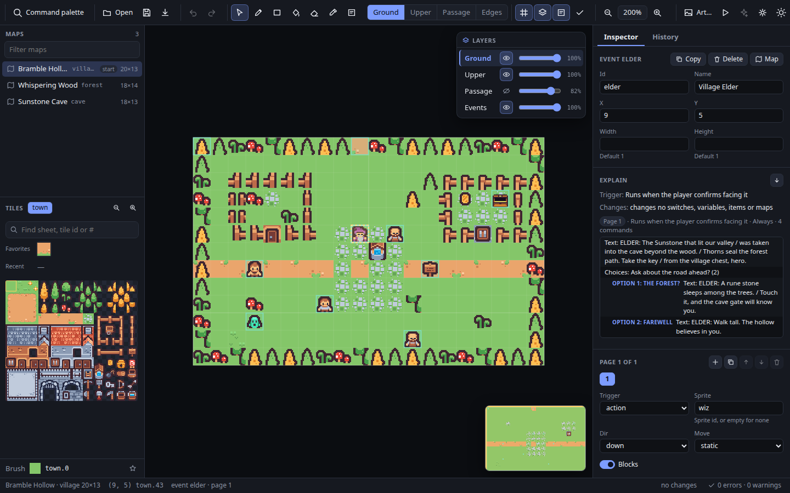
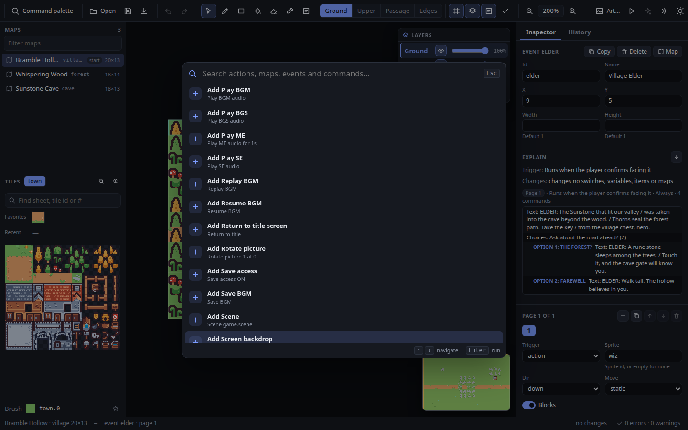
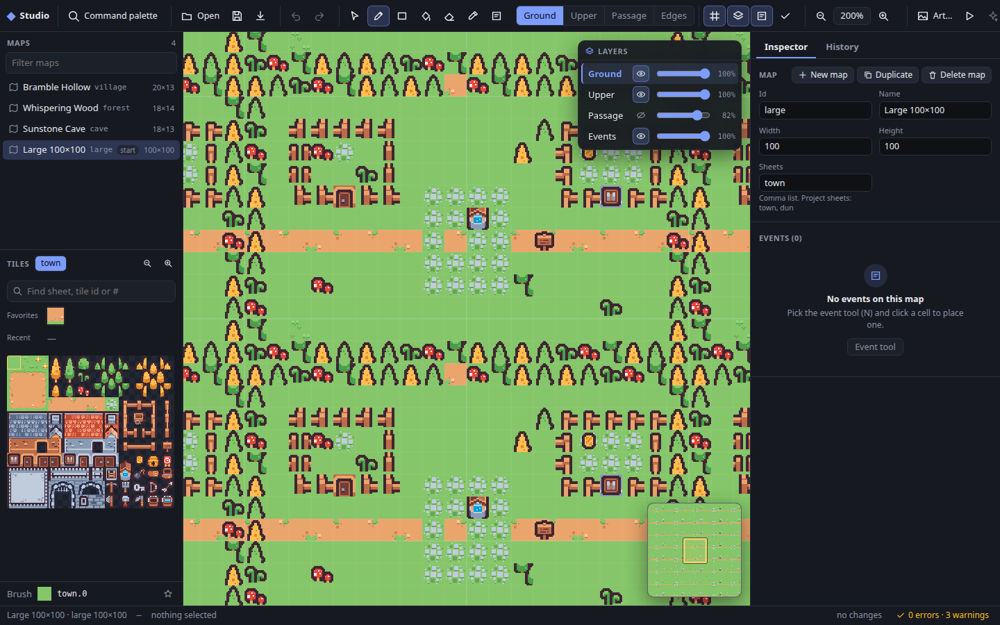
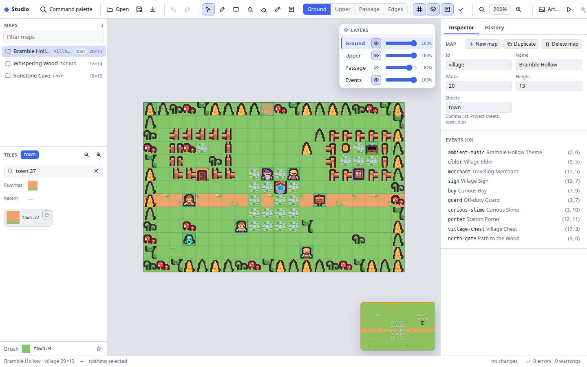
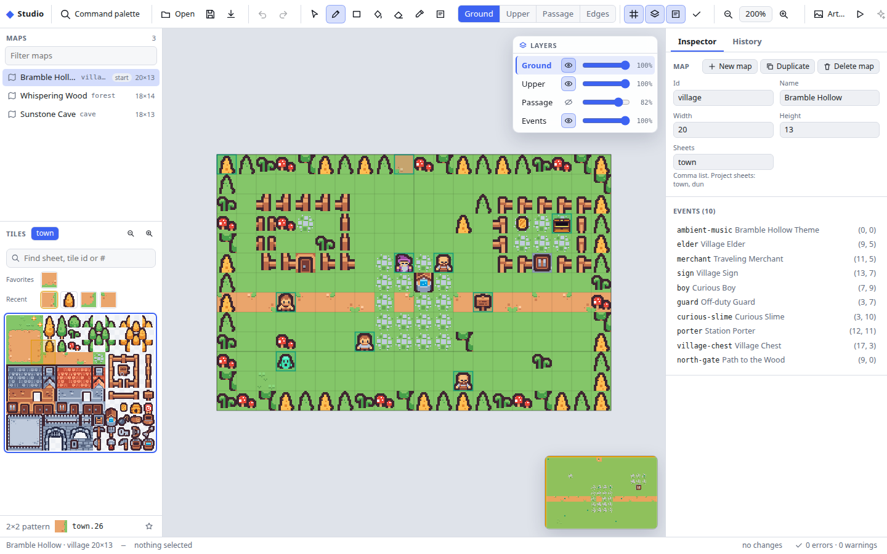
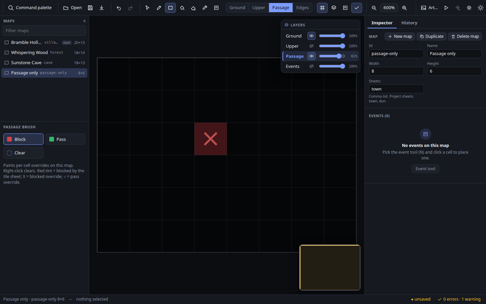
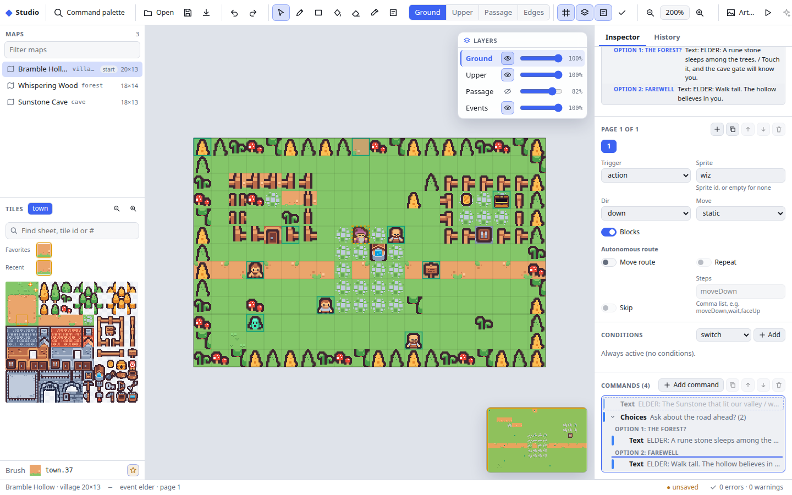
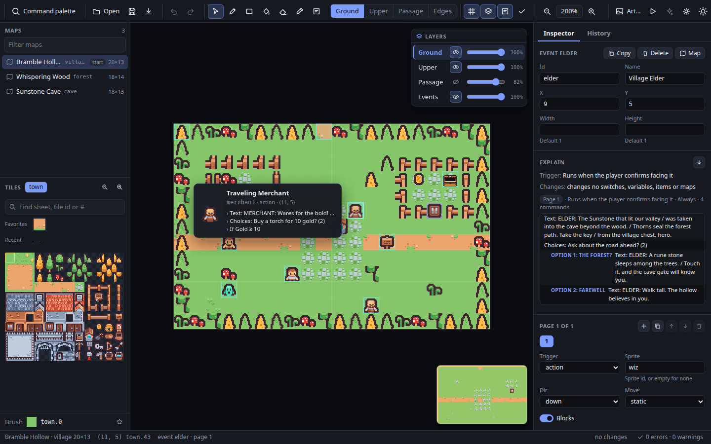
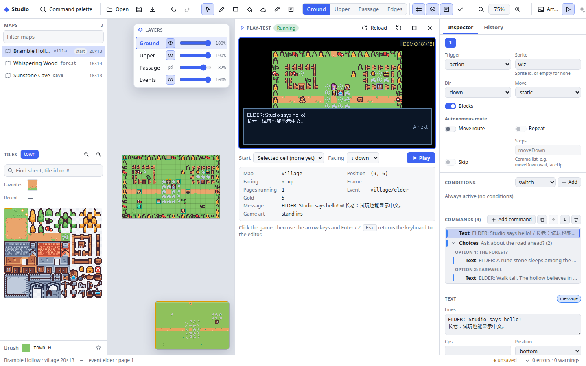
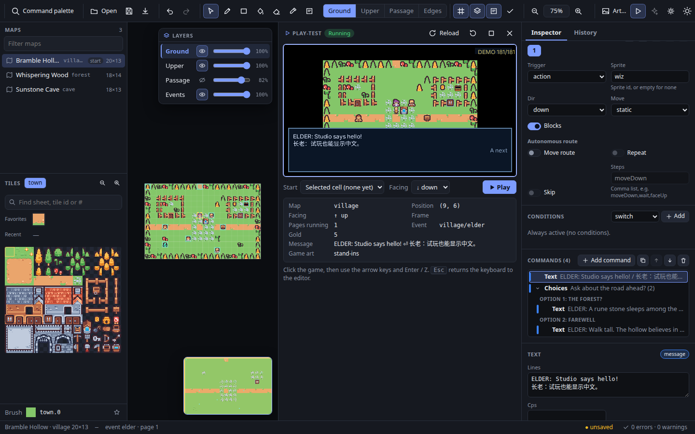

# Studio

Studio is a map and event editor for `rpgkit-project/v1` projects that runs
as an ordinary web page (DOM and canvas). It has no PocketJS bundle budget,
so it can afford a full desktop-style layout: a command palette, zoomable
canvas with a minimap and layer controls, searchable patterned tile palette,
inspector forms, history panel and a problems list.

Studio edits through the [`editor/api`](edit-api.md) operations — the same
ones `rpgkit-edit` and its MCP tools run — so every change Studio makes is a
reversible `rpgkit-edit/patch-v1` patch. The
[PocketJS editor](../editor/README.md) runs the same operations through
`editor/api`'s in-memory entry point (Studio uses the text one; see
[Protocols](protocols.md#2-edit-protocol--rpgkit-edit)) and keeps the same
patch-v1 history. The two editors also share the file formats
(`rpgkit-project/v1` and the sharded shell, shard and pack formats), schema
validation and the save serializer. `tests/editor-api-equivalence.test.ts`
drives the same edit sequence through both and checks identical patches
after every step, identical undo/redo stacks and identical saved bytes. The
PocketJS editor is the one to use on the desktop host or a device; Studio
is the one to use in a browser.



## Opening Studio

- Hosted: <https://lfkdsk.github.io/pocketjs-rpgkit/studio/> (the site's
  landing page links to it).
- Locally:

  ```sh
  bun run web                              # builds dist/web, including dist/web/studio
  python3 -m http.server -d dist/web 8000  # open http://localhost:8000/studio/
  ```

  `bun tools/studio-build.ts --outdir <dir>` builds only Studio into
  `<dir>/studio` (no WebAssembly core needed).

Add `?example=sunstone`, `?example=meadow` or `?example=sunstone-pack` to
the URL to open a bundled example directly.

- As a desktop app: [Studio desktop](studio-desktop.md) is the same Studio
  in an Electron window. It saves project files and folders in place (not
  only in Chrome and Edge, and single files too), runs local agents whose
  edits you review as proposals, and runs `rpgkit-check`'s engine checks.

## Files

| Action | How |
| --- | --- |
| Open a local file | **Open → Open file…** (Ctrl/⌘+O). Accepts inline `rpgkit-project/v1` JSON and `rpgkit-edit/sharded-pack-v1` packs. |
| Open a project folder | **Open → Open folder…** (Chrome and Edge). Picks a folder holding a `ProjectShell` (usually `project.json`) and its map files; see [Project folders](#project-folders). Other browsers show the item disabled, with the reason as its tooltip. |
| Open an example | **Open → Example: …** — Sunstone, Meadow, and Sunstone as a sharded pack. |
| Save | **Save** (Ctrl/⌘+S) validates the document, then writes it back into its folder if it was opened from one; otherwise it stores it in this browser's `localStorage`. If storage is unavailable or full, a red notice says so and nothing is marked saved. |
| Restore | Reloading the page reopens the saved document. |
| Download | **Download** (Ctrl/⌘+Shift+E) saves the exact export bytes: the project JSON, or a complete replacement pack. |

Nothing is uploaded. Inline documents keep the bytes of everything you did
not change: the export is produced by the same source-preserving serializer
as the PocketJS editor's Save. For the same edits the two editors write
identical bytes; `tests/studio-session.test.ts` ("export matches the
PocketJS editor's save bytes for the same edits") checks this for a paint,
a new event and a text command.

### Sharded packs

A pack is one JSON file that carries a `ProjectShell` and the text of every
map shard it indexes (the same format the PocketJS editor's web page reads).
Studio opens the catalog first and parses (and checksum-verifies) a shard
only when you open that map. Edits run the sharded protocol operations, so
the downloaded replacement pack differs from the original only in the shell
and the shards you changed; the map list marks changed maps with ●.

### Project folders

In Chrome and Edge, **Open folder…** uses the browser's directory picker
(File System Access) and asks for read and write access once. Studio finds
the folder's `ProjectShell` by reading one file: `project.json`, else
`game.json`, else the folder's only top-level JSON file (with several
top-level JSON files and neither name, it asks you to name the shell
`project.json`). It then checks the map count and every map file's size,
reads each map file listed in the shell's `mapIndex` relative to the shell,
and edits the project as a pack. No map file is read before its size has
been checked, wherever it sits in the folder. **Save** then
writes only the map files whose text changed, followed by the shell:

1. It re-reads each of those files and refuses, writing nothing, if any
   changed on disk since it was opened.
2. It writes every new file as a temporary sibling
   (`<name>.rpgkit-save-<id>.tmp`) and reads it back. If one of these
   writes fails, the temporaries are removed and nothing was replaced.
3. It replaces the map files, then the shell, one at a time (moving the
   temporary onto the file where the browser supports it). If a
   replacement fails, the files already replaced get their previous text
   back, the temporaries are removed, and the red notice says so. If even
   that restore fails, the notice names the files that may now hold the
   new version; saving again finishes the save.

This is **not crash-atomic**: a browser has no way to replace several files
at once, so a crash, power loss or a closed tab between two replacements
can still leave new map files next to an old shell. What it guarantees is
that a failed write does not leave a half-saved project. Saves into one
folder never overlap: Ctrl/Cmd+S pressed while a save is running queues
another one, which starts when the first has finished, compares against
what the first wrote, and saves the document as it is by then. The Save
button is disabled ("Saving to <folder>…") and the status bar shows
"saving…" meanwhile. A save belongs to the document that was open when it
was started: if you open another project while it runs, it still writes
the first folder, its notice names that folder, and the project now open
is not marked as saved. Download still produces a complete pack.

Sharded packs keep their map catalog fixed: Studio disables adding,
duplicating, deleting, renaming, resizing and reordering maps, and editing one-way edges
(they live on project-wide tile sheets), each with a note saying why. Use
the inline project or `rpgkit-edit` for those. Schema validation of a whole
pack reads every shard, so it runs when you press **Validate all shards**
in the problems list.

## Layout

- **Toolbar**: command search, file actions, undo/redo, tools, layer switch,
  overlays, zoom, **Art…**, view settings, theme and shortcuts. Every button
  has a tooltip with its shortcut.
- **Maps** (left): every map, with a filter box. The list is virtualized, so
  packs with hundreds of maps scroll smoothly. Drag a map up or down to
  change the map order (Alt+↑/↓ moves the open map one place); a line shows
  where it will land, and the drop is one `move-map` step. With a filter,
  visible-order changes are anchored to the visible neighbour; dropping back
  beside the map's current visible neighbour is a no-op and never silently
  crosses hidden maps. A sharded pack's map order is its fixed map index, so
  there the rows only open maps.
- **Tiles** (left): the sheets the current map declares, searchable by sheet
  name, full tile id or cell number, with favorites, recently used tiles and
  a size control. With the passage or edges layer active this panel shows
  those brushes instead.
- **Canvas** (center): wheel or pinch smoothly zooms around the pointer;
  Space+drag, middle-drag or Shift+wheel pans; `0` fits the map. A cached
  minimap sits over its lower-right corner and the layer controls over its
  upper-right corner. The status bar shows the hovered cell and its tiles.
- **Inspector** (right): map properties, or the selected event with its pages,
  conditions and command tree. **History** lists every step.
- **Status bar**: map, hovered cell, selection, protocol time of the last
  edit, save state, and the problem count. Click the count to open the
  problems list; click a problem to jump to its map, event and page: the
  canvas glides to the event and pulses around it, and the inspector
  flashes the event.

Empty panels say what is missing and offer the next step: an event list
with no events offers the event tool, an empty page offers **Add command**,
a map filter with no match offers **Clear filter**.

Light and dark themes follow the system setting until you pick one with the
theme button. Below 900 px the panels stack under the canvas.

### Command palette and navigation

Press Ctrl/Command+K or the toolbar's **Command palette** button to search
every Studio action, map, event and command on the open map, plus every
insertable command kind when an event page is selected. Search is fuzzy over
labels, ids and context. Recently run results appear first; Up/Down selects,
Enter runs and Escape closes the palette. Pointer hover changes only the
active row and does not scroll the result list; keyboard movement scrolls as
needed to reveal its active row. Opening the palette does not eagerly load the
other maps in a sharded project.




### Camera, minimap and layers

The minimap shows a cached ground thumbnail, event dots and the current
viewport. Click to center the map, drag the viewport to pan, or focus it and
use the arrow keys. Panning and zooming only redraw its viewport overlay; the
thumbnail is rebuilt after a map, document or art revision changes.

Wheel and trackpad zoom is anchored to the pointer and eases to its target.
Released Space/middle-button drags retain a short, decelerating motion. In
**View settings**, **Follow system** disables both when
`prefers-reduced-motion` asks for it, **Full motion** always enables them and
**Reduced motion** always moves immediately.

The layer card controls ground, upper, passage and event visibility and
opacity. The editing layer has an accent marker; edges share the passage
display row. Keys 1–4 still choose the editing layer, while Shift+1–4 show or
hide ground, upper, passage and events. These controls, the minimap and the
camera are view state only and never change exported project bytes.



## Map editing

| Tool | Key | What it does |
| --- | --- | --- |
| Select | V | Select an event or a cell. Drag an event to move it: its old place fades, the event is drawn at the drop cell with its coordinates, and the frame turns red when it would share a cell with another event; Esc cancels. The drop is one `update-event` step |
| Brush | B | Paint a free-form stroke; right-drag erases |
| Rectangle | R | Paint a rectangle |
| Fill | F | Flood-fill a region of equal tiles (ground and upper) |
| Eraser | E | Erase a free-form stroke |
| Eyedropper | I | Pick the tile under the pointer, then return to the brush |
| Events | N | Click an empty cell to create an event; click an event to select it |

Layers: **1** ground, **2** upper (drawn above characters at run time),
**3** passage (per-cell PASS / BLOCK / CLEAR overrides on this map), **4**
one-way edges (enter/exit rules on the tile sheet cell under the stroke).
**G** toggles the grid and **P** the passage overlay, which tints tiles the
sheet blocks, marks overrides, and draws edge arrows (blue: no entry from
that side, orange: no exit).

A whole stroke is one operation (`paint-cells`, `paint-rect`, `fill-region`
or `paint-edges`) and one undo step. While you drag, Studio previews the
stroke in its cached layer image; on release the protocol validates and
applies it, and an invalid stroke is reverted with a notice.

For ground and upper tiles, type in **Find sheet, tile id or #** to search all
sheets declared by the current map. Star a result or the current brush to put
it in the persistent Favorites strip; committed choices appear in Recent.
Drag over the atlas to select a rectangular pattern. With the atlas focused,
Arrow keys move the selection and Shift+Arrow extends it; Enter or Space
accepts it while keeping the atlas focused and the whole pattern highlighted.
Brush and rectangle strokes repeat the pattern from the stroke's origin; a
rectangle drag previews those repeated tiles before the pointer is released.
The patterned form of `paint-cells` sends parallel `cells` and `values` arrays
as one operation, so the preview, commit and undo all remain one step. A map
whose only authored content is a passage override keeps that overlay visible
without the empty-map guide covering it.








## Events

Select an event to edit its id, name, position and size; copy or delete it
(Delete key, Ctrl/⌘+D duplicates). Pages appear as tabs: add, copy, delete
and reorder them, and set trigger, sprite, facing, movement type, blocking
and the movement route. Conditions list every clause of the page condition
with its own fields; any schema condition kind can be added.

The command tree shows the page's commands indented by branch, with a colour
bar per kind (flow, message, state, movement, presentation, audio) and
collapsible branches. Drag a command to move it: the upper half of a row
drops before it, the lower half after it (or into its first branch when
that is open), a branch header at the top of that branch, and the space
under the last row at the end of the page. A line shows the drop place;
Esc cancels. A command cannot be dropped into its own branches. The move is
one step (`delete-command` then `insert-command` in one transaction), and
the moved command stays selected. Alt+↑/↓ moves the selected command by one.

 Select a command to edit its fields in a form; the
field rules are the same ones the PocketJS editor and `update-command` use
([`editor/engine/event-fields.ts`](../editor/engine/event-fields.ts)), so
every command and condition in the current schema is editable. **Add
command** opens a searchable list of every command kind and inserts after
the selection or into a chosen branch. The autosave command is searchable
and displayed as **Autosave / 自动存档**.

Pause over an event on the canvas to see its sprite, id/name, first-page
trigger and the first three meaningful command summaries. The card compares
the room on both sides, opens on the roomier side, clamps symmetrically inside
the canvas and disappears when you
move, drag, edit, switch maps or hide events; hovering never changes the
selection.



## Art

Projects name tile sheets and sprites by id; the pixels are not in the JSON.
Studio uses the bundled Sunstone and Meadow art for ids those examples
define. For other ids, **Art…** lists every sheet and sprite with its status
and lets you choose a local PNG for it. The file is used only in this page:
it is not uploaded, not saved, and does not change the project. Ids without
art draw as hatched, numbered placeholders in a colour derived from the id,
so tiles stay distinguishable.

### Project art

A project can keep its own art next to it. When Studio opens a project
folder it looks, relative to the shell file (then the folder root), for the
PNGs the project references: tile sheet `S` at `art/sheets/S.png`, then
`sheets/S.png`; an image sprite at its `src`, then `art/sprites/<id>.png`; a
walker sprite at its `sheet`, then `art/sprites/<id>.png`; an animation at
its `sheet`. Paths that are absolute, contain `..` or backslashes, or are
not `.png` files are ignored, as are legacy walker sprites with one atlas
per facing. The art found is carried in the pack Studio edits (its optional
`assets`, see [`edit-api.md`](edit-api.md), "Sharded packs and their art"),
so **Download** of a folder yields a self-contained pack with its art; saving
the folder writes only the shell and changed map files, never art. Art that
is missing, not a PNG or over the limits below is skipped; when the folder
has any of its art, the open notice says how many files were loaded and
which were missing or skipped.
Studio draws the project's own art when it opens a folder or a pack that
carries art. It comes before bundled example art with the same id; ids the
project has no art for keep the bundled art or the placeholder. **Art…**
lists each id's source ("project" with its path). A single project JSON
file brings no art. The play-test gets the same images (see
[Play-test](#play-test)).


## Problems

The problems list combines the protocol's schema validation (`validate`)
with `rpgkit-check`'s static lint (unknown transfer targets, missing items
or sprites, unreachable pages, unused switches and so on). It refreshes
after every edit for inline projects.

**Run engine checks** (rpgkit-check's dynamic checks, which run the game
engine) and the agent button in the toolbar are disabled on the web page;
their tooltips say why. The [desktop app](studio-desktop.md) has both:
engine checks add their findings to this list, and the agent button opens
the Agent panel, where an agent's proposals are reviewed and accepted as
one undo step each.

## Keyboard shortcuts

| Keys | Action |
| --- | --- |
| Ctrl/⌘+K | Open the command palette; Up/Down selects, Enter runs and Escape closes it |
| Ctrl/⌘+Z, Ctrl/⌘+Shift+Z or Ctrl/⌘+Y | Undo, redo |
| Ctrl/⌘+S, Ctrl/⌘+O, Ctrl/⌘+Shift+E | Save (in the browser, or back into the opened folder), open file, download |
| V B R F E I N | Select, brush, rectangle, fill, eraser, eyedropper, events |
| 1 2 3 4 | Ground, upper, passage, edges layer |
| Shift+1 Shift+2 Shift+3 Shift+4 | Show or hide ground, upper, passage, events |
| G, P | Grid, passage overlay |
| = or +, -, 0 | Zoom in, zoom out, fit |
| Space+drag, middle-drag, Shift+wheel | Pan |
| Drag in the tile atlas; Shift+Arrow with it focused | Select a rectangular tile pattern |
| Delete, Ctrl/⌘+D | Delete or duplicate the selected event |
| Drag a map, Alt+↑/↓ in the map list | Reorder maps |
| ↑/↓, Home/End in the map list | Open the previous/next, first/last map |
| Drag a command, Alt+↑/↓ in the command tree | Move a command |
| Drag an event (select or event tool) | Move an event |
| Esc | Cancel a drag, else clear the selection; in the play-test, give the keyboard back to the editor |
| Ctrl/⌘+Enter | Play-test (from the selected cell unless the panel's Start says otherwise) |
| ? | Show the shortcuts panel (grouped by File, Edit, Tools and layers, View, Maps and commands, Play-test) |

## Play-test

**Play** in the toolbar (Ctrl/⌘+Enter; with the panel open it plays again
from the panel's Start choice) opens the play-test panel beside the
canvas and runs the open document in the real game engine: the site's
[`preview` player page](protocols.md#5-preview-protocol--rpgkit-previewv1)
embedded in the panel and driven over `rpgkit-preview/v1`. Your edits do not
have to be saved first; the game gets the current export bytes.



| Control | What it does |
| --- | --- |
| **Start** | Where the game starts: the selected cell (click a cell with the select tool; with none selected, the project start), the project start, or a chapter. Chapters are offered for documents with the title of a bundled example that has them (Sunstone's Village, Forest and Cave save points); a chapter restores its save point and plays live. |
| **Facing** | The player's facing at the selected cell. |
| **Play** | Loads the latest document and starts at the chosen place. |
| **Reload** | Loads the latest document and starts at the same place as the running game. It is highlighted once you edit after the game loaded. |
| **Restart** | Starts the game afresh at the same place with the document it already has: switches, items and the rest start over, and edits made since wait for Reload. After Stop, it loads the latest document. |
| **Stop** / **×** | Unloads the game / closes the panel. |

Below the game, a readout refreshes four times a second from the protocol's
`state`: map, position (and whether the player is moving), facing, frame
number, event pages running, the event in the main slot, gold, and the open
message box. Its **Game art** line says what the game draws: "project (12
images)" or "stand-ins".

**Keyboard.** Click the game to give it the keyboard (it also takes it when
it starts): arrow keys walk, Enter, Z or A confirms, B or Backspace cancels.
**Esc** gives the keyboard back to the editor. (On the standalone player
page Esc also cancels; in Studio it is reserved for leaving the game.)

The preview host does not install game-specific scenes or the built-in
`rpgkit.numberInput` rules/view pair. Use a built game or fixture with the
matching `GameView.scenes` and `sceneViews` registrations to exercise those
screens; Studio's generic placeholder covers explicit `scene` commands only.



**Art.** The game draws the project's own art where Studio has it: the
tile sheets and sprites you picked from your computer and the images in a
project folder are sent to the game with the document (the protocol's
[`art` messages](protocols.md#project-art)). Sheets are cut into 16 px
cells; image sprites are drawn as they are; walker sheets are cut into the
same twelve frames the asset baker makes. Everything else keeps the stand-in
art the preview page bundles (the PocketJS editor's playtest palette): the
bundled examples' art, sheets with no image (drawn blank), and images the
game cannot use, such as a sheet that is not a whole number of 16 px cells
or a sprite over 512 px (hover the Game art line to see which). Unregistered
extensions, battles and backdrops show the same visible stand-ins as the
PocketJS editor's playtest. Art only changes what is drawn: the game plays
the same with and without it.

Chinese dialogue shows in the play-test: when the game loads the document
it bakes the characters the document uses from a budgeted Chinese face (the
3,755 common GB2312 level-1 hanzi plus punctuation). A character outside
that budget draws as a box, and the panel says which ones (a built game
bakes its own font and draws them).

Limits:

- A document whose `load` message would exceed the protocol's 4 MiB message
  limit is not sent: the panel says how large it is and disables Play and
  Reload.
- Sharded packs and folders are put together into one inline document for
  the play-test (the protocol accepts only inline documents), so the same
  4 MiB limit applies to the whole project.
- Project art over the protocol's art limits (1,024 images, 32 MiB of
  pixels, 4,096 px a side) is not sent: the game plays with stand-in art and
  the panel says why. A preview page from before project art plays with
  stand-ins.
- Starting at a cell uses the host's checked warp: the cell must be inside
  the map, standable and free of events; otherwise the panel shows the
  host's reason.
- Studio only embeds a preview page from its own site, and reads replies
  only from that iframe's window and the site's origin; anything else is
  ignored. A preview page that speaks another protocol version is reported
  in the panel.

## Limits

- Play-test: see [Play-test](#play-test).
- Sprites without art (no project file, no bundled art, no chosen PNG)
  show a placeholder badge.
- Sharded packs: see [Sharded packs](#sharded-packs).
- Browser storage holds one saved document per site origin; download a copy
  for backups.
- Saving a single file in place, and saving a folder after adding or
  removing maps, are not available in the browser.
- Folder saves are not crash-atomic; see [Project folders](#project-folders).

### Import limits

Studio checks the size of what it opens and refuses oversized input with a
red notice instead of loading it. Most checks run on file sizes, before
reading; a picked file between 32 and 64 MiB is read first (it may be a
pack) and then refused if it is a project file rather than a pack. The numbers live in
[`editor/api/limits.ts`](../editor/api/limits.ts); `EditSession`, the pack
reader and shard loading enforce them too, so the CLI and MCP tools share
them.

| What | Limit | Checked |
| --- | --- | --- |
| One inline project JSON file (also a shell file) | 32 MiB | file size before reading; text size before parsing |
| One sharded pack file | 64 MiB | file size before reading; text size before parsing |
| One map shard | 8 MiB | pack reader, shard loading; a folder's file sizes before reading |
| Map shards in a pack or folder | 1,024 | before the shell is validated; before any map file is read |
| A project folder, as the pack Studio edits | 64 MiB | the files' total from their sizes, before any map file is read; the pack's size after reading |
| Maps in an inline project | 1,024 | after parsing, before schema validation |
| Events on one map | 4,096 | inline maps after parsing; shards when loaded |
| Cells on one map | 256 × 256 | the project schema's width/height maximum |
| Local PNG file | 16 MiB | file size before reading |
| Local PNG dimensions | 8,192 px per side, 16,777,216 pixels | from the 24-byte PNG header, before decoding |
| Art images a pack carries (its `assets`) | 4,096 | pack reader; folder open skips the rest |
| One art image in a pack or folder | 16 MiB, and the local PNG dimensions | pack reader from the base64 length before decoding; a folder's file size before reading |
| All art images in a pack, decoded | 32 MiB (the pack itself stays within 64 MiB) | pack reader; folder open skips art past either limit |

Sizes are UTF-8 bytes. A folder's shell is the only file read before the
limits are checked, and it too is refused unread over 32 MiB. Studio edits a
folder as one pack (the shell and every map file's text as JSON strings in
one file), so a folder's 64 MiB limit is the size of that pack. The pack is
a little larger than the files themselves: keys and indentation, plus one
extra byte for every quote, backslash or newline inside a file, which JSON
escapes. Studio refuses a folder whose files alone total more than 64 MiB
before reading any map file, and one whose pack comes out larger after
reading them; a folder it accepts always opens. The largest real project we know of
(about 17 MB of inline JSON, 263 maps, at most 502 events on a map) fits
comfortably. `tests/studio-import-limits.test.ts` checks each limit exactly
at the limit and one over.

## How it is built

Studio is plain TypeScript with no UI framework (`editor/studio/`).

Everything that depends on where Studio runs goes through one interface,
`StudioHost` ([`editor/studio/host.ts`](../editor/studio/host.ts)): opening
files and folders, save and restore, export, picking local art, running
checks, starting an agent, confirmations, closing with unsaved edits, and the
theme preference, and the play-test connection (`StudioHost.preview()`,
interface in [`editor/studio/preview.ts`](../editor/studio/preview.ts)).
Each host also reports which of these it can do, with a
reason, and the UI enables or disables its controls from that. The web page
uses the browser host (`host-browser.ts`). Tests use an in-memory host
(`host-memory.ts`). A desktop shell would implement the same interface
with native files and processes. Opening and saving project folders is
host-neutral code (`project-directory.ts`) written against a small
directory interface. `tests/studio-host.test.ts` scans `editor/studio/`
(every script and page) so that storage, download, fetch, file-picker,
dialog, media-query, iframe and `postMessage` calls appear only in the
browser host. The browser host's play-test (`BrowserPreview`) embeds
`../preview/?embed` (the player page shows only its game screen with
`?embed`) and talks to it; the panel (`preview-panel.ts`) renders the
host-neutral controller `PlayTest` (`preview.ts`), which checks the document
against the protocol's limits and decides what to send. That includes
the page shell: `index.html` only marks a slot (`<!-- studio:host-boot -->`),
and the build puts the browser host's pre-paint theme script
(`host-browser-boot.ts`) there; a desktop shell would use its own page.

The document lives in an `EditSession` ([`editor/api/session.ts`](../editor/api/session.ts)),
which only calls `executeEditOperation` / `executeShardedEditOperation` and
replays history patches through the protocol's `save` operation. The
canvas caches each layer as a 16-px-per-cell bitmap and redraws only when
the document, map or art changes, so zoom and pan cost two scaled image
draws plus overlays for the visible cells.

Tests: `tests/studio-session.test.ts` (every edit kind is one reversible
protocol step, packs only rewrite touched shards, export matches the
PocketJS editor), `tests/editor-api-equivalence.test.ts` (the PocketJS
editor and Studio produce the same patches, history and bytes for the same
edits), `tests/studio-host.test.ts` (the host boundary; open, save,
restore, export and folder saves on the in-memory host),
`tests/studio-directory-save.test.ts` (folder saves with injected write
failures leave the old version), `tests/studio-import-limits.test.ts`,
`tests/studio-inspector-model.test.ts` (including where a dragged command
lands), `tests/edit-move-map.test.ts`, `tests/studio-pack-assets.test.ts`
(project art conventions, packs with assets, art read from folders),
`tests/studio-build.test.ts`,
`tests/studio-playtest.test.ts` (what the play-test sends, art included, on
the in-memory host), `tests/preview-art-sim.test.ts` (the preview page draws
supplied art and plays the same without it) and the browser run
`bun tools/studio-verify.ts`, which drags maps, commands and events, opens a
folder with its own art and plays it. Before each capture it waits for camera
interpolation, inertia and requested canvas drawing to finish, and it freezes
changing readouts and play-test frames. It verifies light and dark polished
states before regenerating their screenshots in `docs/screenshots/studio/`.
The problems-jump flash pulse is covered by the same settle wait (the canvas
re-requests frames for the pulse's ~1 s, so `settled` stays false until it
ends), not a fixed sleep.

`bun tools/studio-verify.ts --double` adds a capture-stability gate: every
documentation shot is captured twice and the two PNGs are compared pixel by
pixel, allowing only anti-aliasing-level differences (at most 0.1% of pixels
differing, no channel by more than 32/255 — text anti-aliasing on a light
background reaches ~20, while a real instability shifts whole regions by
100+). Every shot is static when captured — the play-test is frozen at a
fixed state first — so normal and play-test shots alike are compared; the
one explicitly live (un-paused) play-test shot is excluded since its frame
advances by design. Run it when changing the canvas renderer, the settle
logic, or anything that draws during a capture; it is off by default
because it roughly doubles the capture time.
`STUDIO_VERIFY_MUTATE_DOUBLE=1 tools/studio-verify-double-mutation.sh` is the
gate's self-test: it recolours the page between the two captures of the
normal documentation `shot()` path only (the regression it guards is
"shot() captures only once"), removes the recolour right after the second
capture, and writes its report and screenshots to isolated directories under
`dist/` (never `docs/`). It asserts the run goes red, that every non-live
shot has a name-by-name `double:` comparison, and that every `double:`
failure is one of the recoloured shots — so another double-capturing path
can no longer make the self-test pass while `shot()` itself regresses.
`tools/studio-verify-double-mutation-reverse.sh` proves the self-test has
bite: it builds a temporary mutant of the verifier with `shot()` reverted to
a single capture and asserts the self-test goes red on it.
